# Werkabank

## technik  
allgemeiner Port für Werkabank: 8002

## Beschreibung  
die Werkbank soll Für die KI ein möglichst Token-armer Bereich sein zu testen und für mich auszuprobieren oder zu erstellen.

Du (KI) machst was Du brauchst für kleine Tests
Ich beschreibe hier Module zum bearbeiten.

## propmts
beim übertragen kam von dir:
"Der Abhängigkeitsbaum ist überschaubar, aber die öffentliche Naht hat sich geändert "
beachte dass das ein Modulares System bleiben soll. Abhängigkeiten ok, aber alles modular mit klaren "Nähten".. 

Controls:
    - bitte in die Settings immer (irgendwo, klein) der Name des [Controls](../teslacoil/docs/CONTROLS.md)

20260718_105726
Jetzt kommt ein Umbau:
    - nimm 'Takt' und 'Metronom' aus taktgeber und füge sie hier ein. 
    Beachte, dass 
        - es hier auch um die Definition von 'Gruppen' und 'Control's geht. Ich habe lange und viele Details an teslacoil "gefeilt" - diese Einstellungen sollen größtenteils übernommen werden. Dann habe ich in taktgeber versuch, die nötigen Details von teslacoil in taktgeber zu kopieren - ging nicht, ist alles 'eigener scheiß' geworden.. Jetzt soll taktgeber, noch immer wie teslacoil hier (werkbank) rein, **Werkbank soll das neue aktuelle pool für die Module werden**.. also achte auf jedes Detail und wenn (vermutlich) Konflikte zwischen teslacoil und taktgeber (und Werkbank?) auftauchen, bitte als editierbares listen file mit der offenen Entscheidung [[entweder] wie in taktgeber ,[..oder] wie in teslacoil, oder anders [texteingabe]]
        - es einen e-mode gibt, den will ich **genauso** hier haben!
        - Ich muss es sicherheitshalber noch mal wiederholen: es sind zwei Gruppen!, die man im e-mode beliebig verschieben kann. 

20260718_182230
# Übergabe: Werkbank-Umbau (Takt + Metronom rein, Werkbank = neuer Modul-Pool)

## Ziel
`~/Music/KI_html/werkbank` soll der neue Pool für die Module werden. Takt (Transport/Tempo)
und Metronom aus `taktgeber` reinholen, aber mit **teslacoils** Gruppen-/Control-/e-Mode-
Modell (= Kanon; taktgebers Nachbau war „eigener Scheiß"). Zwei Gruppen, im e-Mode frei
verschiebbar. Später: Keybind/MIDI-Overlay, Metronom-Ton.

## Beschlossene Vorgaben (alle in werkbank/UMBAU_KONFLIKTE.md, Abschnitt „ERGEBNIS/BESCHLOSSEN")
- Control-Modell = **teslacoil** (Fabriken + GROUPS), gespeist aus EINER deklarativen Liste (Fusion).
- Gezogene Werte („ohne Knob") = teslacoil Knob/Fader mit Ansicht „ohne Knob" (nicht taktgebers `drag`-Flag).
- e-Mode = **teslacoil Free-Canvas** (freezeGroup, Gummiband, Pfeile 10px/Shift 1px). ✓ portiert.
- „Technik" = normale Controls in der Gruppe (@dpa ordnet später).
- `segment` = neue Control-Sorte; `keybind` 1:1 aus taktgeber übernehmen.
- State-Kern = taktgebers state.js (kennt Takt+Metro) mit teslacoil-Optik/Klang-Trennung.
- Sorten-Name klein, oben rechts, `monospace`: Knob·Select·Toggle·Text·Note·Button·**UNIKAT** (für `u:`).
- Metronom-Klang 1:1 aus taktgebers metro.js; UI zuerst, Ton als eigener Hördurchgang.
- Phasen: **P0→P1→P2→P3→P4**.

## Stand
- **P0 ✅ ERLEDIGT + headless verifiziert.** `werkbank/lib/group/GroupHost.js` — teslacoils
  Gruppen + Free-Canvas-e-Mode treu portiert. Naht: `mountGroups(root, state, defs, opts)`.
  Deklarative defs: {KNOBS,SELECTS,TOGGLES,TEXTS,NOTES,BUTTONS,DEFAULTS,GROUPS}.
  Gruppen-Settings lean (Name/BG/Head/Breite/Höhe); teslacoils Combo-Presets + Gruppen-
  Snapshots BEWUSST später. Test: `werkbank/lib/group/_selftest.html` +
  scratchpad `p0_test.py` (alle grün: 2 Gruppen, `e`-Mode, Gruppe 10px-Raster verschiebbar,
  0 JS-Fehler). Server läuft auf **Port 8002**.
- **P1 in Arbeit (noch nicht begonnen):** taktgebers `taktgeber/modules.js` (Transport/Tempo
  + Takt/Metronom, alle Keys/Ranges/Infos) → teslacoil-`defs` mappen; 2 frei verschiebbare
  Gruppen; UI-only, kein Ton. „Auf jedes Detail achten" (@dpa).

## Offene Fäden / nächste Schritte
- **P1 bauen:** defs-Datei (z.B. `werkbank/lib/taktmetro/defs.js`) aus `taktgeber/modules.js`
  + `taktgeber/state.js` DEFAULTS. `segment`-Sorte in GroupHost ergänzen (neu). `keybind`
  vorerst als Daten (Taste/MIDI pro Control), Overlay-UI erst P3. Action-Buttons Start/Stop/!/!!/
  Tab/↺ als BUTTONS mit onClick (Audio-Attrappe wie in werkbank.js, „[Audio nicht verfügbar]").
- **P2:** Sorten-Name oben rechts monospace in die Settings-Panels (KnobMetaEditor/ElementSettings).
- **P3:** Keybind/MIDI-Header-Schalter (neben „Helphints?"): an → alles dunkler, über jedem
  sinnvollen Control die Tastenbelegung in-place änderbar; dito MIDI-learn; Buttons kriegen
  Shortcut+MIDI. Große eigene Baustelle.
- **P4:** metro.js + clock.js live einhängen, Hördurchgang mit @dpa.
- **Aufräumen:** `werkbank/lib/taktgeber/` (ganze taktgeber-Kopie inkl. eigenem `.git`) wird
  durch den Neu-Port überflüssig — nach P1 entfernen. Nichts davon (v.a. ui.js) mehr verwenden.
- **Git:** werkbank hat eigenes `.git`, viele uncommittete Änderungen liegen schon. P0 noch
  NICHT committet (würde Fremd-Änderungen mit einsammeln) — @dpa fragen, ob eigener Commit.

## Relevante Dateien
- `werkbank/UMBAU_KONFLIKTE.md` — Entscheide + Phasenplan + Status (Wahrheit auf Platte).
- `werkbank/lib/group/GroupHost.js` — P0-Baustein. `werkbank/lib/group/_selftest.html` — Test.
- `werkbank/ddw.md` (Z.20-27) — der Ausgangs-Prompt.
- Quelle Manifest: `taktgeber/modules.js`, Defaults: `taktgeber/state.js`, Klang: `taktgeber/metro.js`.
- Kanon-Referenz: `teslacoil/js/app.js` (Fabriken ~420-689, e-Mode ~1355-2019, Gruppen-Settings
  ~2035-2191), `teslacoil/docs/CONTROLS.md`.

## Nicht-aus-Code-ersichtlich
- @dpa hört jeden Klang selbst; kein Batchen, ein Change pro Durchgang, nichts „gefixt" nennen
  ohne sein Ohr. UI-Änderungen headless mit Playwright testen, hart nach ~40s killen.
- Panel-Kompaktheit wichtig (Controls/Settings klein & dicht).
- taktgebers ui.js/e-Mode wird NICHT übernommen — nur sein Manifest (modules.js), state.js, metro.js.
- Prompt in `ddw.md` bei Bedarf mit Zeitstempel `YYYYMMDD_HHMMSS` versehen.

## Start-Prompt für neuen Chat
„Mach an der Werkbank mit **P1** weiter (siehe werkbank/UMBAU_KONFLIKTE.md, Phasenplan).
GroupHost.js (P0) steht + ist verifiziert. Mappe taktgeber/modules.js (Transport/Tempo +
Takt/Metronom) in teslacoil-defs für mountGroups, ergänze die `segment`-Sorte, bau die zwei
Gruppen als frei verschiebbare Module (UI-only, Audio-Attrappe), headless testen. Kein Batchen."

Antworten/Prompt:
jo! so war ist in teslacoil, so ist der e-mode super.
Mir fällt auf bei den Gruppensettings da sind ja noch diese schäbigen platzraubenden horizontalen Fader. Das bitte ähnlich wie in Control Settings gestalten.
und ja: bitte weiter, so weit wie du kommst 

-- 
20260718_190738

  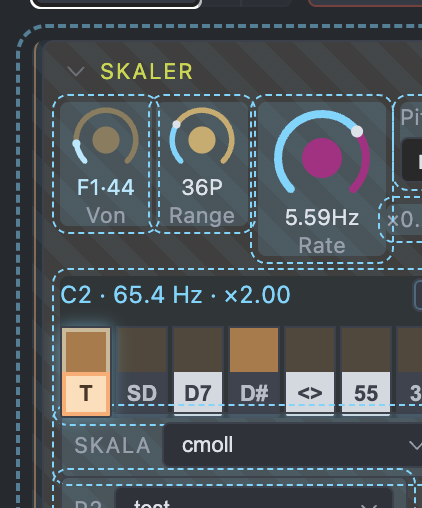
    obwohl es im e-mode größer aussieht, trozdem
    Ich habe eine vorliebe für kleinere Radien! nicht ganz eckig, aber auch nie so "rund". das wäre vielleicht was für ..äh remember? etwas für Musik gestaltung im allgemeinen: Eckenrundungen: kleinere radien (als offensichtlich von Dir üblich)

20260718_203341
Wewrkbank ansiicht jetzt:
  - ich sehe auf der Hauptfläche  mehrere 'ÜberGruppen', Eine davon ist die mit den zwei Taktgebern. Diese überGruppen machen bestimmt Sinn, zum Beispiel als Instrumente, aber erst einmal würde ich nur den Bereich der ÜberGruppe 'Metronom und Transport' anzeigen lassen.
  Der Header ist gut, dann der Strich and dann der "Übergruppe" mit takt+Metronom
  dessen headline kann bleiben (Instrumenten name?), aber potentiell mit eigenen Settings. Aber erstmal noch nicht, jedoch eine ein/ausklapp Icon links - zum einklappen (dann wäre der Hauptbildschirm leer (okay)).
  - 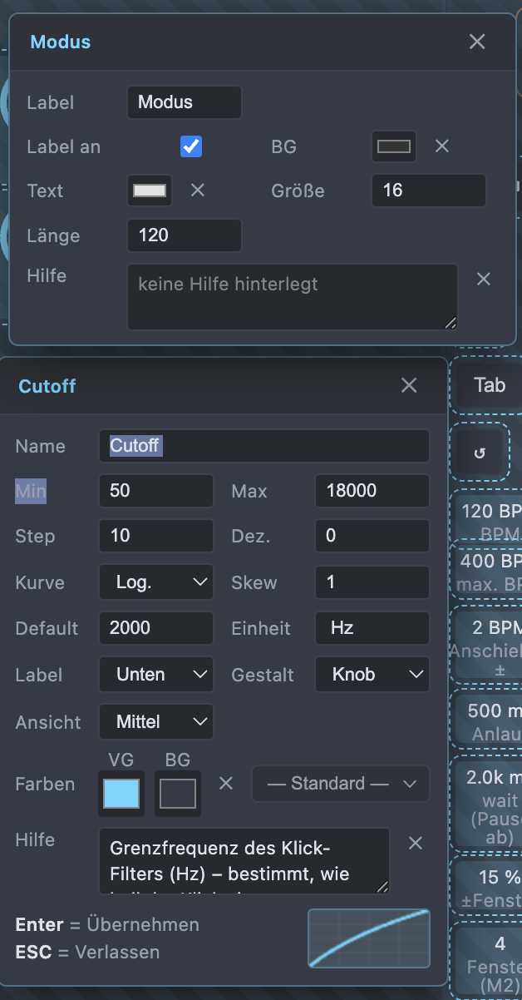
    Das ist bei vielen Controls und Gruppen noch nicht fertig.
  - BPM ist ein `Knob` dessen Value sehr wichtig ist. Deswegen sollte es Schriftgröße und dann auch gleich dessen Padding einstellbar haben. Das kann tatsächlich in `Knob`/Fader überall mit rein.
  - `Button`s brauchen zusatzlich eine ON Farbe. Also 'BG off', 'BG on' und 'Text'. bitte die kompakte zweispaltigkeit behalten und Breite und Höhe bitte in eine Reihe
  - `Toggle` gut so
  - `Anzeige`: Takt beat Anzeige. in Taktgeber hattest Du eine sich anpassende Anzeige mit den jew. Schlag an zeigen, je nach Beats mehr oder weniger. da bräuchte ich alle Farben (Hauptbeat, Nebenbeats, BG) beatGröße, Absände, radius (0=eckig - 1=rund) und noch padding zur BG-Größe und dessen breite und höhe (mit 0=auto)

-- 
20260718_234247
super! vielen Dank!
„Settings bei vielen Controls noch nicht fertig" — da fehlte der ':' und eine Level tiefer, es ging ja dann um die Settings von `knob`,`Button`,`toggle` und `anzeige` und das haast Du gut gemacht.

weiter:
  `SELECT` :
    wenn Label, dann: Label, Label an,
    inhalt: ein (vergrößerbarer) textbereich wo man den inhalt als Table angabe macht. Mit kurzem Beispiel daneben, so dass man alles übersichtlich sehen und kopieren kann. Eine passende kurze Form kannst Du bestimmt dafür anbieten? z.B. für den 'Modus': 
    `Moodus = [1 - konstant, 2 - folgend]` wenn etwas 'nichts' ist: einfach nichts. ein Selector mit 3 Einträgen, mit nur im dritten eine '3' wäre dann:
    `= [,,3]`.. finde ich ganz cool. und ein zusatz, der auch noch bestimmt ob man den letzten aus abschalten kann, dann wäre die Logik komplett untergebracht! Man muss das System nur kennen - deswegen unbedingt ein Fragezeichen button zum öffnen (kompakt) oder kurzer beschreibung und Beispielen?
    Wenn das funktioniert, dann braucht es keine extra LAbelangaben mehr  

    Farben: BG0, BG1, VG

20260719_022824
"Meine Deutung von „letzten abschaltbar" ist ein Settings-Haken (nicht ein Notations-Zeichen). Wenn du's lieber in der Kurzschrift hättest, sag's — leicht umzubauen."
Ja, ich meinte ein extra Zeichen in der "Formel" damit es durch die Formel so viel ausdruck gibt wie möglich, so wenig controls wie nötig.. wusste aber nicht wie, deswegen kam das missverständnis wahrscheinlich. Schlag mal was vor und, wie gesagt, da das Label mit in der Formel steht, braucht es auch dafür KEINE extra SETTINGS!
Und die "Hiilfe" ist ein scherz? "z.B. = [,,3] · [LP, HP, BP]" das ist kein label, kein = keine beschreibung - nichts!! sonst bist Du immer Textmäßig so wild auf worte, aber hier, wo du erklären sollst kommt ein gekürztes kurzes Kürzel?? Du musst es für jemanden erklären, der es noch nicht kennt, muss jeden Part sehen. Nicht einfacj=h das übernehmen was ich geschrieben habe, oder wenn, dann Vollstandig!! maneh.. dies eingabe sollte auch oben hin, ist ja wichtig..
eigentlich geht es doch auch ohne =? `label [elementname1,e2]` dürfte ja auch schon reichen? und dann noch hinten oder vorne irgendein zeichen für's komplett ausschaltbar. Nicht in meinen Worten, sondern compakt, griffig, übersichtlich, verstandlich, allgemeingültig.

--  
20260719_030544
  gut! der Formeltext sollte prominenter wiiter oben stehen, denn er ist etwas besonderes und enthält einiges an Iformationen. mit der Hilfe unter [?] ist gut! Unter dem Text die Kurzfassung fehlt noch 'Label' vor dem '='
  jetzt noch für 'auch letzter ausschaltbar' via '~' hinter der ]Klammer. also `[ein,zwei,3,4]~` wären 4 Buttons, den aktiven auch abschaltbar. aber.. weist du.. da nichts auf dem Panel passiert ohne Dich, kann maa=n auch nucht einfach den Modus z.B. auf 3 oder 4 selectoren setzen.. macht ja keinen Sinn.. ohmann! wie mach ichs nur? es ginge ja sogar auch ein einfacher Buton (`button=[b]`..
  Ich weis!: Du machst für den Selector eine Abfolge von Texteingaben, so viel wie modi vorgegeben sind. mit einfachen schmalen trennern, so dass man z.B. bis zu 5 modi zu sehen kriegt. darunter oder darüber steht dann (als Label) 'Label', select1 oder mode1,.. also ohne die formel, doch einfach direkt in Settings (aber als "auf einer Zeile") eingetragen. "alle aus" können wir später einbauen, wenn es gebraucht wird! 
  Aber zu den namen auf den selectoren, aber **auch auf Buttons**: der Button inhalt wie "1-konstant" ist ja nicht das Label. Also gibt es für Label kein Mitte (hat eh nicht funktioniert) - 'Mitte' kann also raus aus den Labels. Und bei Controls, wo in der Mitte/auf teilen (z.B. Selector) etwas stehen kann, soll auch in den Settings dafür ein Name vergeben oder umbenant werden können. Bei `Buttons` zwei labels (an,aus), für `selector` einer pro selection..
  - Länge tut nichts, kann weg. dafür muss noch SchriftGröße und padding dazu

20260719_033654
Tab hat mit den ganzen Einstellungen schon ein eigener Bereich verdient, der wie "Settings" behandelt werden müsste.. vielleicht ein `unikat` als "öffne sondersettings" ? da drin dann die 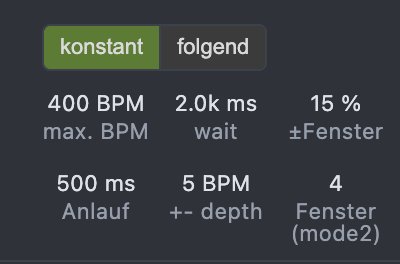 - möglichst klar, hilfreich (kurze Info Texte), kompakt. 
Es fehlt noch die Latenzeinstellung! das muss auch zu Tab..

20260719_040136
die `button`s 
  - brauchen noch die Schriftgröße und padding
  - mussen auch 'aktiv' anzeigen (tut's gerade nicht)
  - Label Pos ist da, aber Label fehlt
  - labelPos verändert die Position des (inneren) Texts
  - default: Text an und aus: beide das gleiche eingetragen
  - Text an und aus mus mit Button an aus umschalten

Tasten/MIDI:
  - bitte zwei buttons, bei einzeln. das macht es übersichtlicher und folgt eher dem flow
  - die diese zwei buttons auch Tasten und Midi zuweisbar!

"Zurücksetzen"
ist wie eine Bombe die man nicht berühren sollte. Bitte mach das mal weg.

Tab settings:
  - ist ja einem Button ähnlich, sollte also auch dessen settings haben (ohne Label & L.Pos)
  - das ist 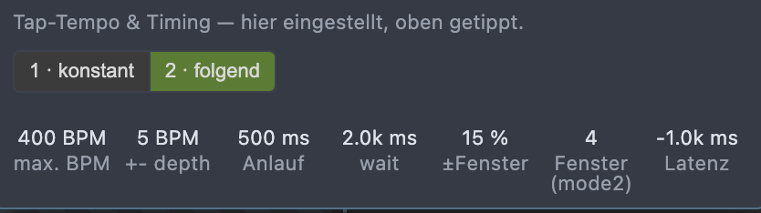! Das sein die Controls 1zu1 rübergeschmissen und fertig. es sollte ausnahmsweise ein hilfreicher aber kompakter text bei diesem sonder settngs stehen.. 
  - Tab control settings: Text an und text aus ändern - Ergebnis nicht zu sehen 

-- 
toll!
20260719_120425
viell schönes hast Du gemacht.. viel schönes zu korrigieren:
  - Control Settings:
    - grundsätzlich: beim schalten von und zu e-mode: die Selektion(en) beibehalten. Bei folgendem Szenario: 
      - ich will einen (oder mehrere parallel) Button korrekt platzieren, was man aber nur ohne e-mode (-Rahmen) sieht. Dafür schalte ich e-mode aus, schaue, ein, * verschiebe, aus, ein, * verschiebe..
      bei jedem * muss ich erneut das Element /die Elemente selektieren - was unnötig erscheint. mit mehreren selektieren.. weis ich nicht ob das auch für 'e-modeAUS' (p-mode) geht? Wäre interessant, wenn es nicht zufällig oder ausversehen passiert.. z.B. via shift+click auf zusatzliiches Control? einfacher click irgendwo anders hin macht dann sein ding und löst die selektion auf.. geht das? dann könnte man im p-mode parallel Werte ändern - ware nicht schlecht...
    - button: Label Pos sehe ich endlich Dein Ansinnen: Die Position innerhalb des Buttons. Das ist aber nicht nötig. Ich dachte:
    - `button` besteht aus Label und Text aus/an. Label ist [aus,über,unter,neben] dem Button, der 'Text' (Caption) ist immer in der mitte innerhalb des Buttons. Deswegen frage ich immer nach dem 'Label'! :) Mach es jetzt 
      - bitte so: (in der Ordnung):
        Label:    [   ]   Label Pos
        Caption:  aus     an   
        _         Größe   Farbe   Padding
        BG:       aus     an
        Button:   Breite  Höhe
        Hilfe:    [                   ] 
      
        - Caption statt 'Text', dafür gibt's 5 Einstellungen, aber einige Einstellungen verbrauchen ja wenig Platz - da werden schon 3 in eine Zeile passen oder?
        - Caption: kann man gut Symbole verwenden, dabei fällt mir auf dass unicode nicht vollstandig ist: Wingdings/2 z.B., ? Aber diese ⚙️❄️?  kriege ich alle Icons - auf für den User (mitgeliefert)?
        - Hilfe: (wie gehabt: ~3 Zeilen, über die gesamte setting breite,  wie immer x und y resizeable, ohne 'x' daneben)
      - der MouseOver Rahmen über den `Button`s ist mir zu Kontrastreich (bitte auch allgemein in Music speichern: sanfte Rahmen (wie das Settings Fenster [super], nicht so wie gerade in Button Mousover.
    - `knob`:
      - 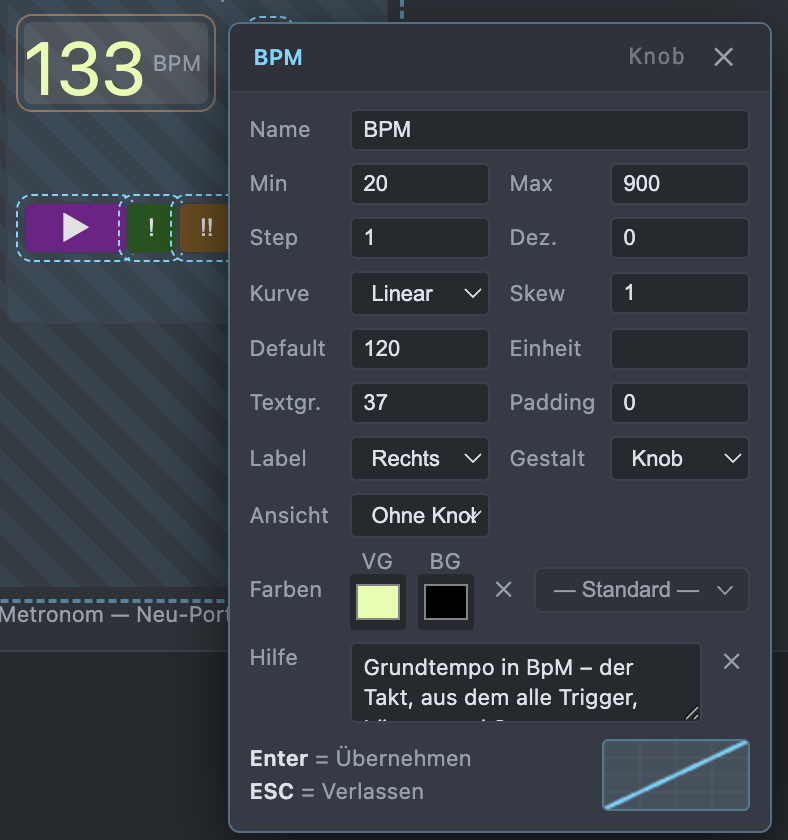 fällt mir oben eine Lücke auf. siehst Du:
        - Padding=0 aber auf der (großen Value) Ansicht bleibt oben ein undefinierter Platz..
        - Gestalt: folgende Änderungen:
          - von Ansicht das 'Ohne Knob' zu Gestalt 'ohne' oder 'keine' moven
          - dann kann "Ansicht" zu "Größe" umbenannt werden.
      - der 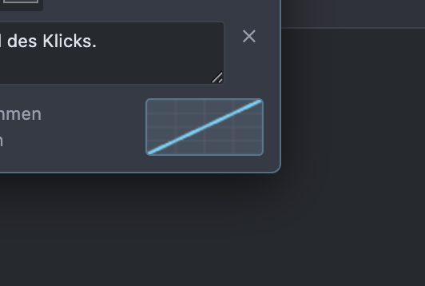: Strich bitte weniger dick und etwas weniger hell..
    - Farben: 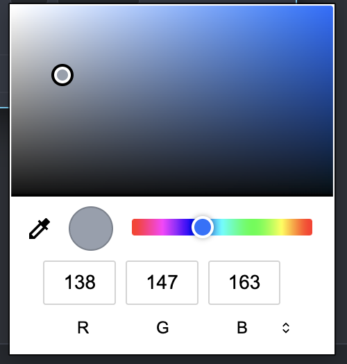
      - das ober Mischfeld höhe kann 2/3 kleiner als jetzt 
      - die Regenbogen auswahl kann so hoche werden wie der Runde Farbpunkt lnks daneben
      - die (default) RGB Ansicht bitte auf 'Hex' stellen
      - mit einem (Copy Icon) daneben (ich glaube links passt besser), der den Wert schnell kopieren kann
  - Header: Tasten und Midilearn
    - bitte nur einen von beiden ativieren (quasi `selector` :)
    - zum Henne-Ei Problem (ich sehe es gar nicht als Henne-Ei, aber ok:):
      - nur den Haupbutton: der Button bleibt frei, "das Learning" wird **darunter**  angezeigt, vielleicht zu Deiner Beruhigung mit einem extra [übernehmen] bzw. [↵]? aber nur bei den "Haupt-Buttons"
      -  wie immer: alles mit help hints.
  - `e-mode`: es gibt noch einen Text (mit kontrastreichem Rahmen (weniger), der sich mit dem Inhalt 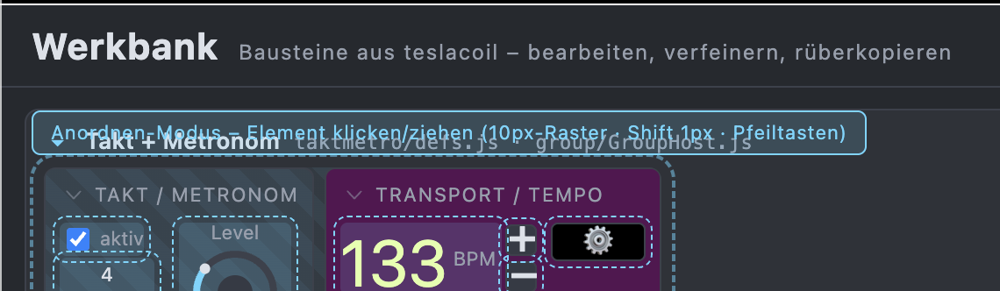.. 

--  
20260719_143232 sent 20260719_2111
- icons.js - ah ja, verstehe: keine "Webdings Fonts", sondern extra gespeicherte Icons - macht sinn. kannst Du sehen was ich damit: oder  meine und kannst es nachbauen?
  
- "labelPos = aus/über/unter/neben" - 'aus' 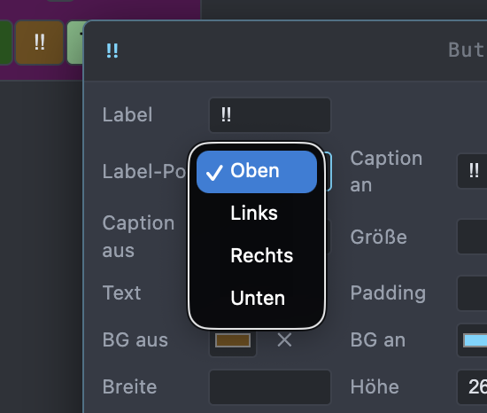

- Header: `Tasten` und `Midi` sollten, wenn aktiv, mit in einer Sine frq= 2 Hz sanft hell und dunkel markieren, dass man den Button nicht vergisst.
- allgemeine Zahleneinstellungen: 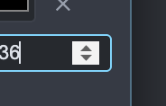 gehen diese (sehr hilfreichen Helfer!) etwas(2-4px?) größer - zumindest die Bedienung? Man trifft oft das falsche..
- Midi learn: 
    - ist derzeit ganz unten mittig. Es sollte wie die settingsfenster bei den tatsachlichen Controls erscheinen.
    - der aktuelle Control sollte eine auffälligere BG Farbe kriegen
    - ESC Taste verlässt Midilearn mode (btw: nicht im Tastenlearn-mode)
    - die hints, welche Note/Control gerade aktiv ist ist super, aber bei Noten muss der tone name mit dazu (z.B. C#2)
    - 
- 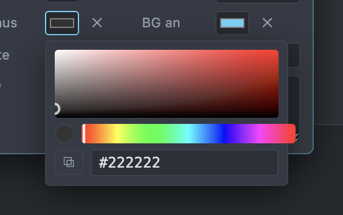.. 
    - Der Hintergrund der Farbeinstellung sollte einen leichten Kontrast zu anderen Settings haben (z.B. add #0003?)
    - 'Hex' soll nicht das einzige sein, es sollte nur das Erste sein, der Default! Die anderen 'Farbangaben': durchschaltbar bleiben! Der copy Button bleibt, aber kopiert entsprechend der 'Farbangabe' (wenn es dafür standards gibt? Ansonsten den standard #rrggbb)
    - die Pipette ist weg! Die war wichtig!
    - der Punkt mit der farbanzeige ist kleiner geworden, das ist nicht gewollt!
    -  Der Regenbogen ist zu lang bzw. das Arrangement ist irgendwie verschoben (siehe Bild)
    -   beim klicken in die Farbangabe soll sich (immer, überall!) der gesamte Inhalt selektieren. das war schonmal so, wäre schön wenn das in Music allgemein gemerkt wird (>remember?)
- Controls
  - `button` Ansicht:
    - der Rahmen toggled On/Off, egal ob es ein Trigger ist oder ein Toggle. Dieser Rahmen kann weg
    - wenn es ein Trigger ist, wäre es schön wenn die Farbe von An nach Aus faded (ähnlich einer D-Env)
    -  wenn es ein Gate ist, dann natürlich die  Farben 'an'/'aus' schalten, Solange der Button gedrückt ist
    - bei Toggle: ist klar: an und aus..
- Control Settings:
    - `button`: 
        - Label-Pos:
            - ist immer gespiegelt ('oben' ist unten)
            - es fehlt "ohne" (das Label kann geschrieben bleiben, zeigt es aber im Panel nicht an.
    - `knobs`:
        - bitte ein 'Value?' für die Sichtbarkeit von Value An/Aus
            - damit springt auch das Label, wenn 'unten' hoch
            - und der gesamte Bereich ist dann kleiner (logo)
        - Fader waagerecht: padding=0 aber trotzdem ist ein großer Abstand links und rechts. siehe 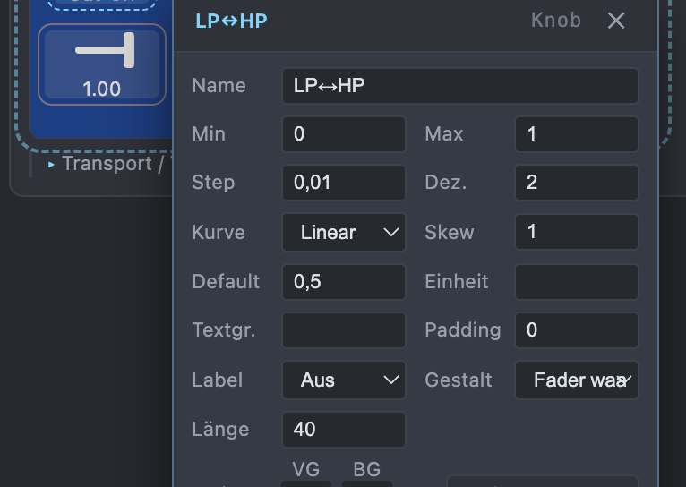. Das wird wichtig wenn (wie auf dem Bild) er links an eine Grenze stößt.

- Gruppen Settings:
    - auch diese **mit Header** wie Controlsettings mit allem (u.a. verschieben, dunklerer BG ( #00000033 ..?), sanfter Rahmenkontrast.. natürlich ohne `control`namen)
    - es stehen dort noch 2 Eintrage die ich nicht kenne und die auch nichts tun: Neben BG und neben Head die '100'..?
    -  statt Head: VG (was damit dann die Schrift meint)
    -  und mit kleinem Hinweis unten: Enter = Übernehmen, ESC = Verlassen

anderes:
    - Control LP-HP in Gruppe 'Takt-Metronom':
        - im e-mode springt dieser beim click (auf seine 'ursprungs position', die er gar nicht mehr wissen sollte?) Du weist noch: 10px raster mit "internen 1px offset"? Das schien größtenteils zu funktionieren, aber manche Controls springen dann dochh immer an "alte" offsets/positionen..
    - 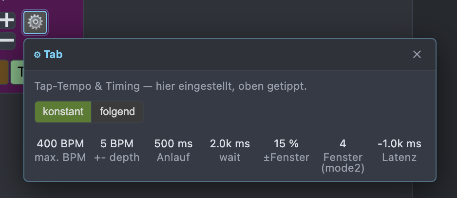 Sind noch immer unfertig und ohne Hilfen. 
        "...hier eingestellt, oben getippt." ist sinnlos. es sollte eher eine kurze Beschreibung der gesamten Tab Einstellung beschreiben.
        dann kommt 'konstant / folgend' - daneben was der Unterschied bedeutet
        die unteren Einstellungen senkrecht:
        | Label | [einstellung) | Hilfstext |
        | Label | [einstellung) | Hilfstext |
        ...
        - Es fehlt auch die Info/Angaben zu tatsächlichen Latenzen und SR (bitte pinglich auf die Latenz genauigkeit achten! siehe Taktgeber)
    - Tempo angabe: wird noch nicht upgedatet siehe /Users/dpa/Music/KI_html/werkbank/CODE_REVIEW.md ab zeile 10
    - der Text unten im "Instrument" 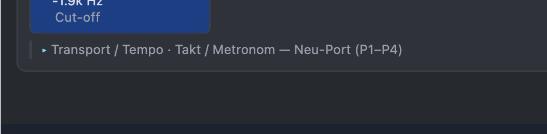 soll eine Beschreibung sein? Die Position gefällt mir nicht, die nimmer immer Platz ein.. Vielleicht im Header rechts ein '[?]'? zum aufklappen..?
    - die übergruppen, (btw: mach für Werkbank bitte auch eine Übersicht wie '/Users/dpa/Music/KI_html/teslacoil/docs/CONTROLS.md'): ich nenne sie mal "instrument"e

-- 
Farbwähler: hervorragend!
"585a5b2 Button-Label-Pos ": thx!

"1c53571 Zahlen-Stepper größere Bedienfläche (image-10). Reines CSS."
kann ich leider nicht bestätigen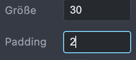 und sie fehlen mir..

prüf nochmal aber mach dann direkt weiter, reihenfolge ok
go

-- 
Pfeile wieder da? Ja, aber auch wieder mini!
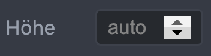
sie sitzen darin nicht ganz heimisch :)
das ist ok, aber größer muss es ja gehen Rahmen kriiegen o.ä.? oder gibt's für die Art "Pfeile" ein Manual? Auf  das ist einfach zu fummelig... Ach! ich weiß: wir können eine Main Einstellung einrichten, wo man sollche Daten wie Eingabegrößen prozentual beeinflussen kann.  geht das einfach?

Button-Optik + Modi" ist Klasse geworden! toll! Ich musste zunächst irgendetwas ändern, dann hat es updated (hervorragende Lösung) 

Jut! mach zuende !  ohne mir zu zeigen, mach einfach zuende

-- 
20260719_235311
cool danke.
e-Mode-Sprung : verstehe! danke.

-- 

"Tab-Set neu": 
    die Funktionen:
    mehr infos findest Du in taktgeber
    und was es tut kannst Du doch auch herausfinden..
    max BpM: tab geschwindigkeit alles was darüber ist wird so oft halbiert, bis es ins tempofenster passt
    +-depth: ist die tiefe, die + und - auf dem Panel ±verstellen
    Anlauf: ist das timing bis +/- auf ±max kommen
    wait: die zeit für die der (durchdachte) Timingmesser noch mitdenkt
    ±Fenster: bei längeren Abständen zählen dann diese Abweichung zum aktuellen Tempo (glaub ich)
    Fenster(mode 2): Mode 2 war mal 'folgend', d.h. dass das tempo sich mit jedem gültigen schlag direkt synced, was das mit "Fenster" zu tun hat würde ich gern wissen. Ist zu lesen in taktgeber. Brauchst Du mir nicht erklären, das muss Dein (selbstandig erstellter) kurzer Hilfstext tun.

"Icons nachbauen"
    das war der Test: die gepasteten (zu sehen waren nur vierecke fur "unbekantes fontzeichen" , Hast du nicht sehen können, alles klar, Ende.

'metroCutoffOffset' = 1kH
'metro2OnDownbeat' neu!: = [0,2 - 4] * metroCutoffOffset
was war daran "Audio-Defaults"?

Main /Tastenlearn': 
    - das Icon für '' (nichts) ist ein irritierendes Symbol (ich sehe da schlechtes Aliasing!) und der BG ist ja hell gelb bei der Eingabe (gut)deswegen: leer ist besser.
    - Elemente Funktionsstop, mit der Mouse nur Selektion der Controls ('radio')
    - Es muss für die Vergabe doch ein Filter rein: ESC, Enter, Tab. Die dürfen nicht gelearnd werden
    - ESC soll typischerweise stufenweise die (groben) Funktionsebenen escapen: edit, Fenster,..

Instrument header: rechte mouse settings
    BG Farbe (mit alpha)

Controls
    `knob`
        ich sehe in Ttransport Control 'BPM' welches sich eigenartig bei deim Tempo dragging verhält. Die einzelschritte sind zu groß. Step(size)=1 für die tasten pfeile funktioniert das super, aber für die Mouse muss man glaube ich einen Bereich zwischen min und max bestimmbar zu machen (in main settings?)

Gruppen Settings:
    kannst Du mal probieren wie es wären wenn du ein Größen % Control einbaust? [50-200]%

jetzt mal andlich zu den Modulen
Gruppe Metronom
    + und - (den arbeitsnamen weis ich nicht mehr (wäre cool: Label temporär löschen - dann erscheint das Urlabel oder ID?) haben nicht die originalfunktion! es sind gerade einfache BPM adierer. Es sollen ASR funktionen sein mit ±max='+-depth', A&R='Anlauf'

    Cutoff2 = "Cut-off" benannt (kannst Du eigentlich sehen, was ich auf dem 'localhost:8000' geändert habe?)

--  
20260720_024109
    Tab set 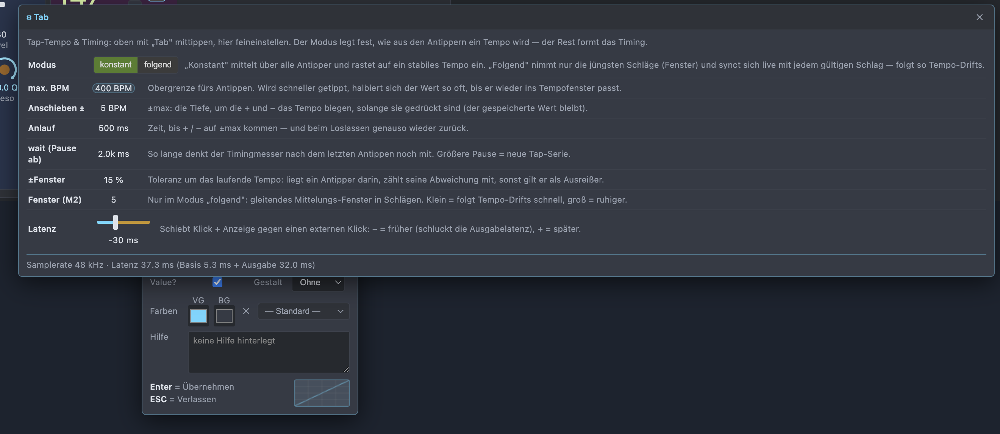
        - Die Hilfetexte machen das Fenster sau lang, bitte mit Umbrüchen 
        - die Hilfstext größe ist zu klein bitte +20% größer
        -  (siehst die auf dem Bild image-18.png unten ein überdecktes Settingsfenster? Das ist von einem Control auf dem TabSet.. die Control Settings müssen über dem TabSet fenster liegen
        -  wäre toll wenn TabSet Fenter verschiebbar wäre (via drag im header) 
        - ansonsten super!
    - Gruppe Transport Control BPM: 
        - Da mussen wir drüber nachdenken (wurde auch in  [CODE_REVIEW.md](CODE_REVIEW.md) bemerktt: BPM ist gerade ein Knob, Aber auch eine Anzeige (über das aktuelle BpM). man muss es also knob/fader Control mäßig ändern können, aber auch die Tab Steuerung annehmen, also auch "Anschieben" von + und -. Letzteres ist noch nicht zu sehen.
    - alle Settings - Hilfe Texteingabe: 
        - Enter funktioniert noch nicht, Da braucht man Enter für Zeilenumbrüche
    - Help Hints: 
        - die eingegebenen Hilfstexte sollen auch als Help Hint angezeigt werden
        - Es soll ein Button "Hints" im hauptheader neben "MIDI", der die mouse over Helpphints für alles An und Abschalten kann
    - die Gruppengröße funktioniert super!
        - allerdings gibt es beim **Platz** für die 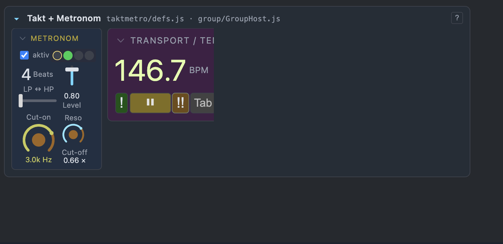:
            - es gibt 2 "Plätze"/Areas für das Instrument "Takt + Metronom"
                - Das größere farbige Instrument
                - Der unsichbare (reservierungs-?) Platz (RP)
            - wenn es RP braucht, muss der beim Gruppengröße verändern auch erhöht werden
            - der Instrument BG.. dessen Größe ist ja noch undefiniert, spontan würde ich sagen, er ist genauso groß wie RP? Und in Instrument settings könnte man (wie in Gruppensettings) die Größe von 0=auto bis ..? einstellen können..?
        - der Gruppen Header soll sich nicht in der Größe verändern
        - auf die Gruppen %-Große-Einstellung müsste irgendwie in den Gruppensettings hingewießen werden, weil da stehen ja dann "inkorrekte" Zahlen. ein einfacher, klarer, aber unaufdringlicher Hinweis in den Settings im header oder untendrunter?
    F — Knob Maus-Feinheit:
        gut! 
        Ich betrachte gerade BPM, mit Step=0,1, Dez=1, Maus=44
        Shift macht einen Unterschied (gut), aber 
            - feiner bei Mouse drag sowohl up down
            - gröber (±1)  bei up/down
            - da es im e-mode 'fein' ist, würde ich es durchziehen und shift auf "allgemein feiner" setzen, also z.B. *1/10..?
            - null reaktion wenn man erst shift dann mouse dragged..(bug)
            - gibt's eine Möglichkeit für "*10"? alt oder cmd(andere OS:ctl)?
            - Metronom Cut-on funktioniert die pspontant up/down gerade nicht - muss ich die ganzen Details alles beschreiben oder kriegst du das alleine raus was da nicht richtig funktioniert wie oben beschrieben?
        <ignore>
        das ist der richtige Ansatz. Aber Die einstellung ist noch nicht klar: 1 ist das feinste (aber für besondere Einstellungen noch nicht fein genug) je größer das Setting um so gröber. Ich dachte: dass die volle range von min-max angegeben werden könnte und dann man werte von etwa 100 - 99.999 o.so eingeben kann,
        </ignore>

    - "TAsten lern"
        - click auf ein schon gelerntes Feld resetet es (soll es nicht)
        - die selektiin der Controls in diesem mode soll den "Lernteil" aktivieren! nicht nur die Controls!
        - mehrfach selektion ist irgendwie möglich - falsch! es soll 'radio' sein
        - esc scheint das learn zu verlassen (ok), aber dann wird es aber dunkelgrau 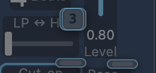 und man kann danach auch nicht sehen was drinn steht
        - 'kein shortcut' sieht derzeit 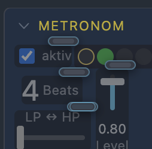. bitte halte die Anzeigen in der (schrift-)Höhe 
        - bei m selektieren des Controls (=Taste learn aktiviert) soll dieser sine förmig pulsieren 1Hz, bis ein letter angekommen ist, dann soll es den hellen BG, schwarz den Buchstabe obendrauf zeigen
        - delete: löscht den letter im aktiven learn und ist direkt bereit zum neu learnen
        - learn bereitschaft soll (wie schon gesagt:) sine förmig pulsieren 1Hz
        - diese Eingaben etwas 10-15% größer
    - "„Kannst Du sehen, was ich auf localhost:8000 geändert habe?" — Nein."
        - ok, dann bau mir das Speichern und Laden dieser Datei(en) in die main Einstellungen ein, damit ich Dir alles übergeben kann.

    neue Gruppe(/Instrument?):
        `button` "Rec" toggle Button mit rechte Mouse Settings
        nimmt audio out auf.
        extra `unikat` Settings:
            mp3 (hohere Qualität) oder Wav
            Speicherort

"I (e-Mode-Sprung)"
    VERGISS DAS!! haben wir bereits verhandelt: Vergiss es, bis ich Dir näheres dazu gebe. Nicht weiter forschen!! 

-- 
20260720_174239
Okay dann erst mal webm/opus

Controls trigger: sind ja mit D-Env bestückt (super) aber sie sollen jeden trigger den der Trigger macht anzeigen, d.h. auch Midi und tastatur shortcut.

`Tab-set`
    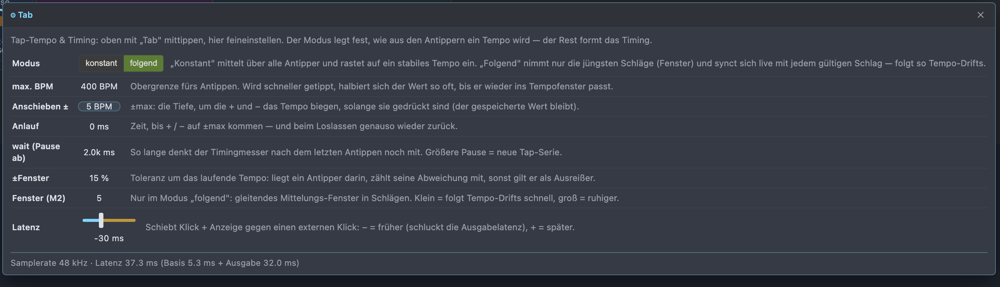
    BItte kürze die Breite dieses Fensters auf 600px. Der Text soll dann einfach "umgebrochen" sein. 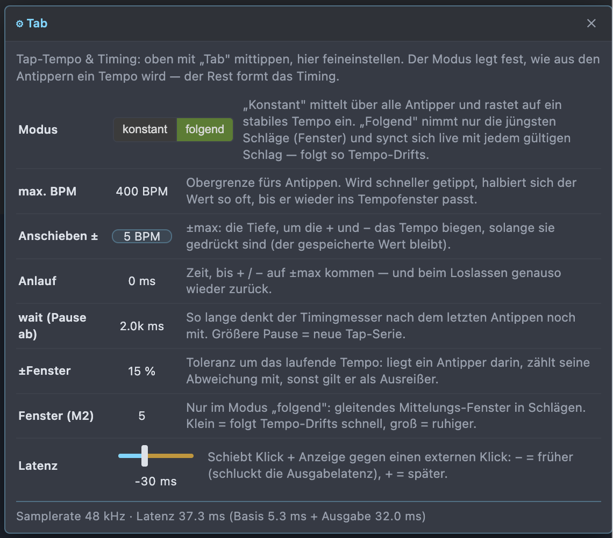

'Tasten lern'
    bitte auf 'radio' achten! Ich kann derzeit noch mehrere Felder gleichzeitig aktivieren!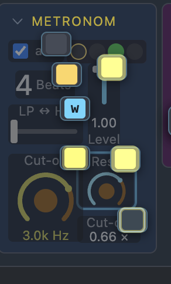 immer nur ein aktives learn feld!
    Das verrückte ist: sogar 'Tasten' aus, wieder an: sind sie noch immer selektiert! 

'Hints' und 'Config' kriegen auch tasten und midi learn

-- 
20260721_114745
- Instrument (ism) `Rec`:
    - ok! nimmt auf, Name ist etwas wie "Recname-20260721095323.webm"
        Recname     - ist klar
        -20260721   - ist auch klar
        095323      - falsche Zeit oder was ist das?
        .webm       - dazu im folgenden mehr:
        Was ist webm und wie ist es einzuschätzen? 
    Geht webm automatisch zu wandeln (z.B. via ffmpeg), würde ich gern  
        ein extra 'Settings' Button hinzufügen, der entscheidet, was direkt nach der Aufnahme passieren soll:
            - nichts (es bleibt *.webm)
            - MP3-wandlung 
                - es erscheinen Einstellungen: 
                    - CBR | VBR
                        - bei CBR Bitrate in kbps, 
                        - bei VBR min und max Bitrate (ich muss zugeben dass ich keine Unterschiede gehört habe, zu Auswahl nicht alle, sondern nur 64, 128,192,256,320)
                    - Mono/Stereo
                    - Qualität (unsichtbar, fest): =3
            - Wav
                - es erscheinen Einstellungen: 
                    - 16 ] 32 Bit
                    - SR (22,24,44,48,88,96kHz)
                    - noch was?
        es wandelt direkt nach jeder Aufname
    - Start/stop sync: am Takt Start umschalten, also man klick irgendwann Start, dann geht rec (genau) am dem nächsten On-Click (0C) (bei 4/4 zum beispiel immer bei 1( an, dann clickt man wieder=Stop - beim  nächsten 0C geht es aus. so dass man Loops machen kann..
- Gruppen 
    - Die 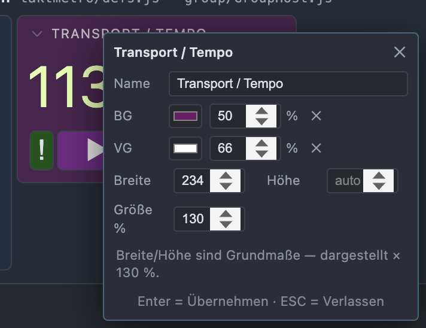 hier:#ab9bae ist nicht gleich der Eingabefarbe #ffffff 
    - Der Hinweis mit der Größe muss nicht in die Gruppen Settings, sondern in deb Control settings, dessen Größe verändert ist. ich stelle mir z.B. vor, dass in dessen header mit einer linearen Gate ASR-Env mit Zeiten [0.5,2,0.5] aufleuchtet "Größen via [Gruppe/Instrument/Gruppe und Instrument] geändert." mit doppelclick: zeig nicht mehr (beschrieben mit extra hint auf dieser Anzeige)
- neues instrument:
    - polyphoner Synt mit
        - polyphony einstellbar
        - 2 Osc pro voice
            - Verstimmbar zueinander [0..99 cent] (cent ist glaub ich ein 1/100el eines Halbtones? wie auch immer: ein Vermerk in CONTROL.md wäre gut)
            - der zweite ist via toggle akivierbar, wenn deaktiviert, dann auch keine Verstimmung (auch nicht anzeigen)
            - pro Osc einstelluungen wie in teslacoil Audio-OSC (ein Poly für beide)
        - eine simples Keyboard 
            - (gleiche breiten, wie teslacoil BaseFreq Ton: Base-Keyboard, aber über mehrere Oktaven (einstellbar [1-9]octaven), start mit C (evtl. verstellbar aber erstmal nicht)
            - click erzeugt Gate ([vel 127])
                - extra toggle für "hold": On: sendet NoteOffs erst beim ausschalten, Off: normal Gates
            - Tastatur auch via Midi (auf 'hold' achtend)
            - das Keyboard har einen ausklappbaren Vel bereich: 0=off, 1..127 Gate on mit entsprechender Vel
                - man kann mir der mouse die aktiven gates (also alles über 0) frei draggen (Ich stelle es mir so vor dass man frei draggen kann und dabei die Anschlagstärken der aktiven Noten verstellen kann)
                - daneben wieder ein 'Dyn' knob (wie teslacoil AmpEnv 'Dyn')
        -  diese unter hold gesetzten Akkorde sollten über Button ein und Ausschalter sein (AkIO)
        -   Es sollte eine "Speicher" zum speichern und aufruf unterschiedlicher Akkorde erstellt werden, zunächst 3x3, aber die Menge ist einstellbar.
            -  beim Wechsel kurz NoteOffs und die neuen NoteOns
        - es gibt hier aucuh eine Gruppe 'BaseFreq' (BF) (kopiert von teslacoil) [incl. allem :)](~/Downloads/teslacoil_backup_20260721_131544.json)
        - Die Tonefrequenzen werden quantisiert auf die Vielfachen der BF, wie in teslacoil bekannt.
        - Amp env:
            - ADSR attack linear, dec und release log, peak Vel* abhängig
    - alles was in BaseFreq verstellt wird, wird mit einem einstallbaren "LP"smooth) direkt in die Oscillatoren eingearbeitet.
    
-- 
20260721_154522
    Weist Du, Du stoppst (immer "bewußt"). Ud schon wieder zu früh: es ist Rec eingebaut, ja, es funktioniert noch nicht richtig (müssten wir fixen), aber es ist eine Klkeine DetailAufgabe, die ic h noch gar nicht richtig testen **kann**, weil es nur Metronom gibt! Bitte führe doch bitte ein paar mehr Punkte duch! Ohne nach dem nächsten Schritt wieder zu stoppen. das kostet nur sinnlos Zeit!
    btw.: kanjnst Du ein Audiozeichen geben wenn Du stoppst?

-- 
20260721_162648
    "Gruppen-UI-Größenhinweis" 
        nee, falsch.
        Der Hinweis soll **in den control settings** erscheinen, und zwar immer wenn man control settings aufruft (bis man es global dismissed hat, dann nirgends mehr.
        - ASR Timin super
    - Instrumente 
        - soll man (via header) verschieben können
    - Rec 
        - nicht in Poly drin, sondern als Extra Instrument
    - Instrument allgemein
        - mit eigen Einstellungen (erstmal gleich wie Gruppen)
    - PolySynth: sieht korrekt aus, aber das Thema ist hier Audio, und stumm ist quasi nur die 'Fassade' - sinnlos
    
"Außerdem: Feedback-Memory zum Nicht-zu-früh-Stoppen gespeichert, Stop-Hook mit Audioton (Glass.aiff) eingerichtet."
ich hoffe du hast es richtig verstanden: ich meinte nicht die Werkbank, sondern den Chat.. Du hast gerade wieder gestoppt, was nach meiner Meinung nach zu früh ist (siehe stummer Synth..). Diese überflüssigen Stopps meine ich! Und der Audioton beim stottern
ich hoffe du hast es richtig verstanden: ich meinte nicht die Werkbank, sondern den Chat.. Du hast gerade wieder gestoppt, was nach meiner Meinung nach zu früh ist (siehe stummer Synth..). Diese überflüssigen Stopps meine ich! Und der Audioton beim stoppen auch: wenn der Chat auf eingabe wartet, dann soll ein Ton darauf hinweisen. Verstanden?

"Grenze erreicht:"
mit Grenze meinst du diesen stopp? Oder was meinst du?

-- 
20260721_203557
toll! 
    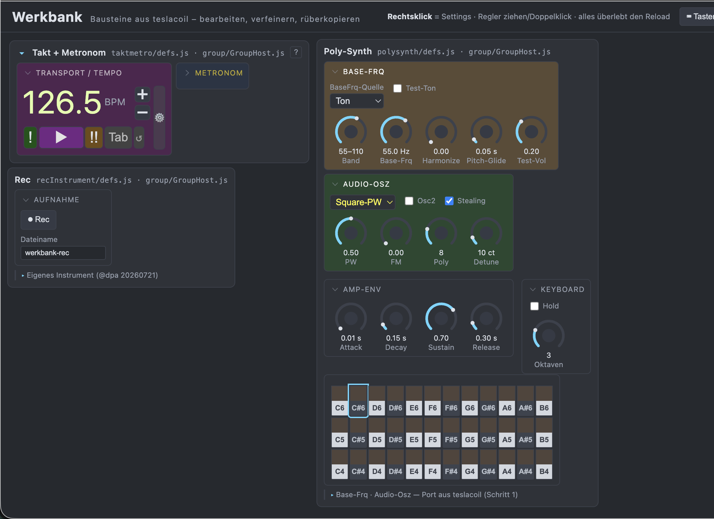
    Instrumente:
    wir haben 3 ism (fyi: ism= 'Instrument', diese Abkürzungen bitte in's von Teslacoil Vorbild abgeschaut teslacoil/docs/CONTROLS.md für werbbank erstelltes werkbank/?/CONTROLS.md)
    die `instrument`e sollen die gleiche Basis haben. Ich betrachte jetzt die Ansicht und "Takt+Metronom" als Vorbild:
        - der soll den Namen (z.B. Takt+Metronom) in diesem etwas fetteren weiß darstellen (ok), 
        - den BG dahinter (ok), 
        - ohne die foldenden infos (z.B. "taktmetro/defs.js - group/GroupHost.js") die sollen dort weg.
        - rechts oben das [?] mit der Beschreibung drin (ok).
        - das für alle ISM (die Info unten wandert in [?])
        - Wünsche:
            - in den [?] Hilfen ein Symbol 'Edit' Button, der die Hilfe in Markdown editieren kann.
            - Settings: 
                - ism Name
                - ism breite, höhe (0 auto)
    - Poly-Synth
        - Keyboard 
            - das ist ein `Control`! wie in teslacoil. Also bitte mit entsprechenden Settings (schau sie von teslacoil/basefreq ab)!
Eine der **Hauptaufgaben ist in 'Werkbank': modulare Syntheshizer gebähren**. (dasist ein guter Hauptsatz dieses Projekts!, bitte merken!), es basiert auf Modulen, was für auch Dich heißt: wie kriege ich diese Bereich ohne viel tokens, vielleicht sogar einfach kopiert oder objektweise nutzt. Die Werkbank macht gerade beides: sowohl die Objekte/Module verfeinern und neu bauen, als auch Projekte vielleicht zu "verdichten", dem Sound anzupassen.. Ich denke gerade laut, Du sollst das unbedingt wissen für das Konzept - ohne ständig alles durchschauen zu müssen.. davon müssen wir weg. Wenn Du dafür Tips hast - gerne! 
            (zurück zum Auslöser:)
            Bitte nichts mehr "einfach so" dazu stellen. Wenn Du nicht weist, ob Control oder ism, oder.. frag mich. aber alles hat hier seine Module. klar? für's Projekt bitte merken.
            - dieses Keyboard gehört mit in die Gruppe Keyboard (logisch :)
            - die Octav Höhe, wo es anfängt, also von welchem C es biginnt muss noch als control dazu
            - bei hold=on soll man angeschaltete Noten auch einzeln ausschalten können (togglen)
        - Base-Freq
            - Test-Ton schalter und Volume (und technik dahinter) weg

-- 
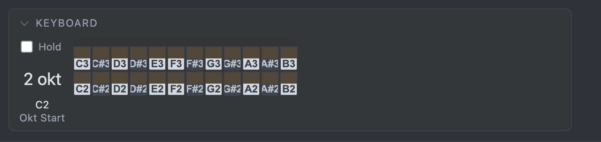 - Dass die Oktaven in Zeilen sein können ist gut, aber nicht üblich. Ich würde sagen: Du machst eine Einstellung in `unikat` Keyboard Settings: oktav[umbruchicon]: togglet die Ansicht auf die derzeitige Ansicht zu ein horizontales keyboard

--
20260721_231818
ich brauch noch unbedingt den Akkord Speicher. Den hatte ich schonmal beschrieben.. Hattest du das vielleicht verwechselt mit dem Keyboard? Es sollten 3X3 zunächst Flächen/Vielen Dank.

20260721_233233
gute Frage, hab eine besondere Antwort: Den Speicher nutzen:
die KB-Tasten, die im moment des triggerns eines Speicherplatzes aktiv sind, sind im speicher.
der Speicher verändert sein aussehen/farbe... beim drücken eines beegten speichers ruft man das gesammelte Gate aus, es überschreibt sich danach nicht, es sei denn es ist ein zusätzlicher `button` "[R]" (für "reset") aktiv. Dann "löscht" man die noten vom speicher.

20260722_004312
    - controls
        - `Select` Settings
            - Optionen [?]" ist undurchdacht
                - Der name.. [?] reicht
                - Das fenster ist hinter den Settings, man kann also gar nichts lesen
                - danach kann ich erst sehen, ob Du den Edit button eingebaut hast für den  markdown edit dieser Info
        - "AkIO" und "R" sind `toggle`s, es sollten `Button`s sein
        - Keyboard akkord speicher: ist jetzt am Keyboard, er soll aber autark neben keyboard als eigenen Control `speicher` werden. (und das Keyboard als control `keyboard` oder `kb` ist sicher auch keine schlechte Idee). `speicher` kann man die speicherquadrat größe einstellen, ob es nummern sind oder eigene Kürzel (via doppelclick?) default numern (startend von 0 oder 1), BG, VG1 (unbesetzt) VG2 (belegt) VG3 (..irgendwas gibt's bestimmt:), und die Tabellengröße mit den gegebenen Zeilen und Spalten, nuur in und als Settings Eingabe

20260722_013727      
    - die Zwei Dinge
        - Text Area sieht gut aus, edit ist da 👍🏻
            - Aber: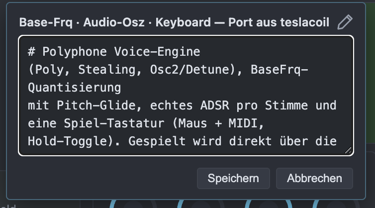 # Überschrift und Zeiilenumbrüche zeigt es nicht. **Fettes** schon.. wie ist es aufgebaut? wieviel arbeit/code/Aufmerksamkeit benötigt es?
        AkIO: siehe unten.
    - Gruppe
        - Base Freq
            - der Regler 
                - 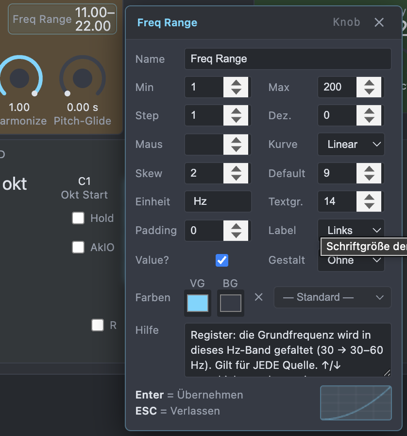 zeigt manchmal .00 an, obwohl in Settings Dez.=0 gestellt ist. 
            - Quelle: Ton: das KB fehlt! (siehe teslacoil) dazu auch gleich: Kammertonfreq angabe default: 440Hz.
            - Quelle: Tempo: kein Anschluss? es gibt ja ein Tempo.. daran anschließen.
            - und die Freq Anzeige fehlt auch. Am besten geteilt in mehrere Control `readout` und `text`s: 'Tone' (z.B. C-1), Freq
            - 
        - Osz
            - die Änderungen sollten standig upgedatet werden.
            - Sine-FM zeigt FM, verbirgt PW
            - Square-PW umgedreht: zeigt PW, verbirgt FM
        - Keayboard
            - AkIO: brauchen wir nicht. die belegten Speicher sind nur noch gates, wenn Hold an ist bleiben sie an (Umschalten wie gehabt)
            - es sind ja akkord Gates, wenn aus, sollten die Amp Env ins Release übergehen, aber es bricht nur kurz ab.. bitte korrigieren. btw.: zunächst ist die Amp Env einstimmig für alle voices
            - es packt nach dem Reload die Tastatur ganz links hin 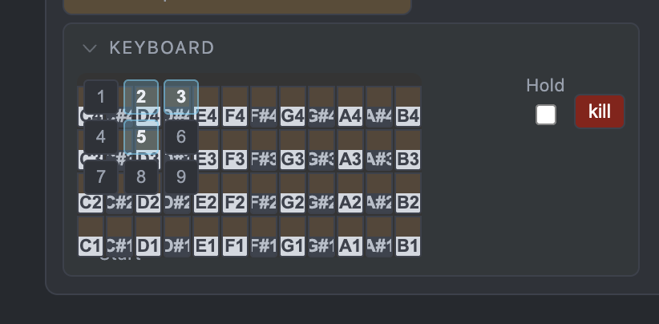   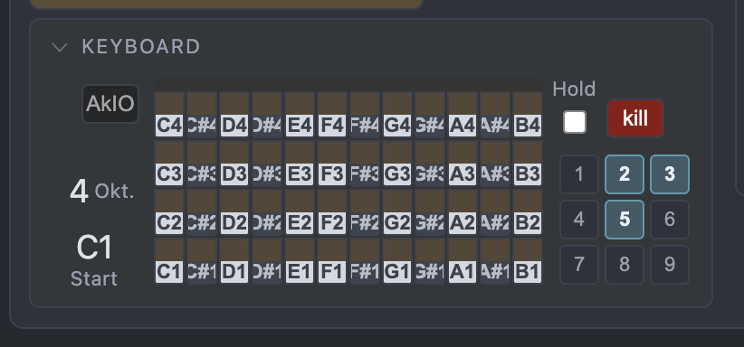. ein kurzer gang in e-mode bereinigt das, aber es Wäre schön, wenn das gleich so korrekt angezeigt wird. 
        - wir brauchen einen **Master Volume** mit Einstellungen:
            - Default (doppelclick)
            - dB basiert, von .. bis
            - eine compressorschaltung die bei 0dB ansetzt ohne extra Latenz: "Limiter" mit IO Schalter, Attack (default  0.5ms0 und release (default 250ms) 
            - Fader länge, Farben
            - Valaue sichtbar IO
            - verübergehend auch "Größe" des Faders
            Der Fader soll  waagerecht im **Header** sein. "Bausteine aus teslacoil – bearbeiten, verfeinern, rüberkopieren" kann weg, "Rechtsklick = Settings · Regler ziehen/Doppelklick · alles überlebt den Reload" ist schon eine wichtige Info für Afänger.. sollte nicht den Header vollmachen.. weißt Du was besseres?

        - Ich brauche auch einen **LevelMeter** (wie in teslacoil), aber auch mit Settings 
            - vielleicht kommst Du nach Master Vol auuf die nötigen settings regler? probier es, ohne mich zu darüber auszufragen. Ich kann es ja danach verändern
            - es soll dem Level "ISM" angehören, aber kein header besitzen und keinen extra BG
            - die Anzeige rechts auf dem Hauptdisplay hat sich bewährt, aber wie so vieles: man kann es im e-mode verschieben
        - Rec
            - also von den Syncs habe ich noch nichts gefunden
            - Rec nnimmt nichts auf (oder?)
            - Rec schaltet man einmal ein, danach "blinkt" er immer, egal wie oft man ihn schaltet
    - Control
        - es ware schön, wenn alle Controls ihre Einstellungen in deren Settings **speichern** könnten und die Designs damit dann für andere, gleiche Controls zur verfügung stehen. Gespeichert wird das ganze aussehen ohne die text eingaben (Label, Hilfstext,..) Nimm teslacoils ausarbeitung: 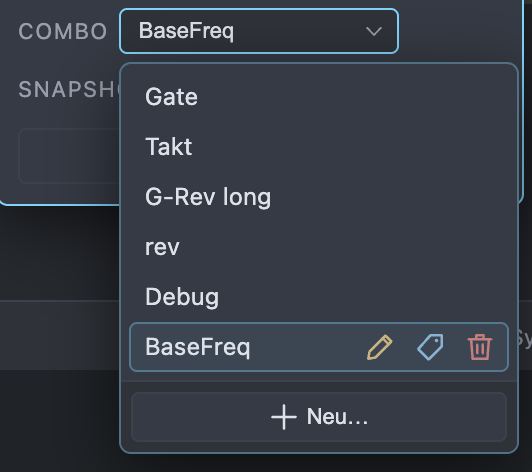
        - die selbst geschrieben texte erscheinen noch nicht als mouse over help hints
        - `button`: Umschalter: wenn sie aussind schalten sie direkt beim click an, wenn sie an sind beim release aus.
        - Keyboard "R" reset ist gerade verdreht: auf BG off ist er aktiv.. kann sich das verdrehen? Oder war das falsch angeschlossen?

"Soll ich das umsetzen (AkIO-Button raus, Speicher-Slots werden selbst zum Ein/Aus-Gate inkl. Release-Fix)"
hm.. Wenn ich darüber so nachdenke, ist das nichts für den "Speicher". Der Speicher triggert eigentlich nur entweder Save oder Recall. Das wird auch ein anderer Speicher dieser Art irgendwann tun. Aber trotzdem würde es hier sehr gut passen.. Ich will die Gate Funktion auf den Speicher Buttons. Also nimm den Speicher recall, verbinde ihn mit einem Gate ON, und bei mouse release ein release trgger.

20260722_033950
Jeder Speicherplatz im Speicher soll remotes learnen können

20260722_042020
die Farbpaletten müssen wir leicht überarbeiten:
    -  die fließende Farbwahl auf diesem Bild gefällt mir. Die Mitte ist sogar (horizontal) länger also nötig, es könnte super auf 200x200px passen. das passt gut zu dem nächstren Punkt
    - der Farb mode HSL zeigt nicht mehr alles, was schade ist, weil rechts die helligkeit schon ganz cool zu drehen ist.. bitte mach diesen bereich breiter und die zahlen dariin vielleicht sogar dragbar? Fehlt nur noch die Anzeige der tatsächlichen Farbe.. hm.. fällt Dir eine Ordnung ein bei diesen neuen Anforderungen? Copy und Pipette soll auf jeden Fall bleiben! Und die Größe muss auch nicht minimal sein..
Base-Freq:
    immer sichtbar: Harmonize, Pitchglide und die Anzeigen
    Quelle Freq: Keyboard und Kammerton weg (gehört nur zu ton)
    Quelle tempo: Keyboard, Kammerton, Base-Freq (knob) weg

-- 
Poly-Synth
    wow! die Farbeinstellung sieht jetzt super aus, ist super nützlich! ein Bug noch:
        das Farbgebungsfeld 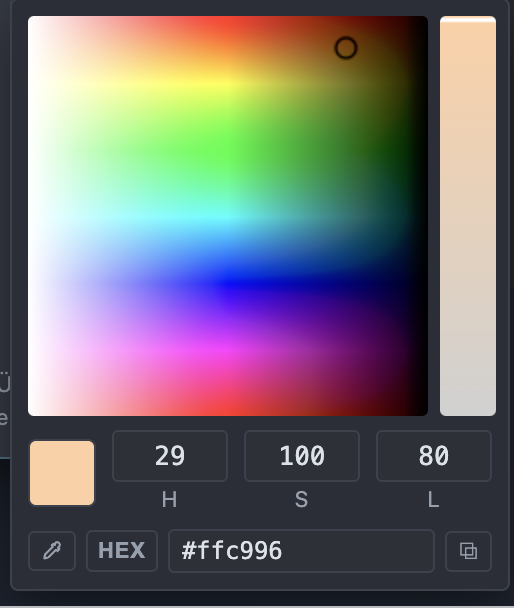 bzw. die Übernahme davon ist verkehrt herum: es macht rechts (zeigt schwarz) heller (>weiß). Wie rum der Fix ist, ist mir egal, hauptsache das Feld und das resultierende Ergebnis ist das was man erwartet.
    AmpEnv: Release funktiioniert noch nicht (oder ein ähnliches Problem):
        wenn man so lange hält, dass Sustain aktiv ist, schalten die NoteOffs auf gefühlt 1/10 Lautstärke herunter und dann kommt das Release.. das ist schon die ganze Zeit so, nichts neues
    Keyboard
        - hold bitte als `Button`
        - die Tastatur bei aktiven Tönen nicht die "Rahmen" der Tasten sondern die Tasten selbst
        - Die Rahmen weniger kontrastreich, und 
        - bei mouse overs über den Speichern anzeigen
        - Doppelclick für 'Name ändern' geht leider nicht (das wiederholte drücken ist musikalisch sinnvol und passiert ständig ungewollt) - vielleicht den "R" Button durchschaltbar: [aus, rename, reset]?
        - Keyboardspeicher..-Learn: meintest Du, hast Du für jeden Speicher zur verfügung gestellt? Das sehe ich nicht 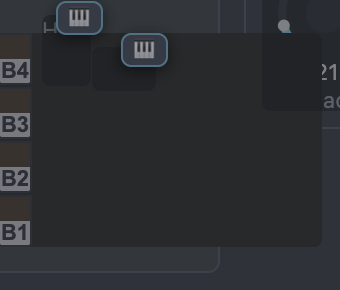, 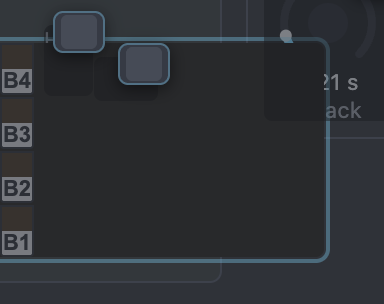..
LevelMeter: 
    sehe ich noch nicht. allerding ein neues leeres mini Feld 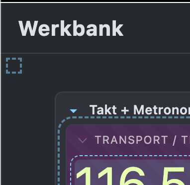.. ist es das? :) ich konnte es nicht ziehen, nicht verändern..

-- 
20260722_130710
zuerst die BUGS ab Zeile 639
    Meter: ist in einem eigenen ISM (gut), ohne Header (richtig) aber hat dadurch keine Möglichkeit es zu verschieben, nur den Control, was zu einer "mess" 
    .. ich kann jetzt nicht mehr weiterarbeiten.. :(
    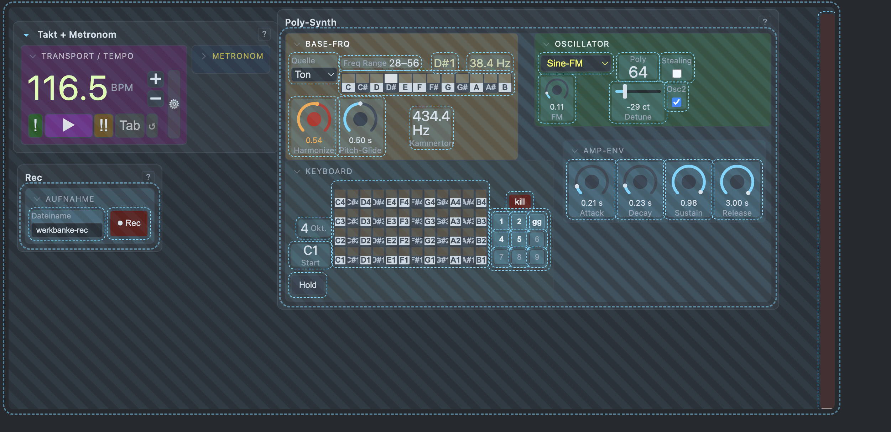 
    ISM
        [?]:
            auch den Titel editerbar machen 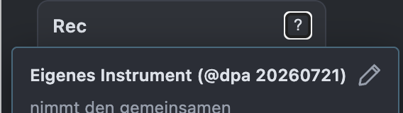
    ISM Rec:
        was ist aus dem synchronen start-Stop geworden? Ich glaub du hast daran schon gearbeitet, aber auf dme Panel ist davon noch nichts zu sehen..?
    BUG!: ich kann nichts mehr selektieren, nichts mehr verschieben!
    BUG!: Farbwähler offen: das gesamte Panel verschwindet hinter einem rießigen Farbfeld und bleibt danach (Panel verschwunden)

-- 
schon getan (wie's scheint noch nicht)?:
    Hilfen/Texte: bitte bei Texten für Helphints Zeilenumbrüche (in der Hint-Ansicht) übernehmen

ISM info
    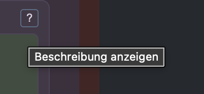
    - die [?] Icons sollten  aussehen. und sind dafür da bei mouseover die informationen zu zeigen (nicht "Beschreibung anzeigen" sondern den Text!) und bei click kommt das extra Fenster (ok).
    - mit dem mermaid ist super!
    - alle text fenster dieser Art (fließtexte) sollten recht unten die eingabeGröße verändern können. Das ist teilweise schon, aber manchmal nicht X UND Y, z.B. bei ISM info geht nur vertikal

Poly-Synth/Keyboard/R:
    Du hast für R sehr schön die Modi mit "blinken" unterschieden. Das ist aber derzeit noch unklar: bei blinken überschreibt es, bei AN löscht es. Außerdem hätte ich gerne unterschiedliche Farben.. weistewas? wir machen einen einen erweiterten `select` daraus (oder lieber einen extra `select button`?:
        - settings neuer Mode: [menu (wie select bisher), inplace (Button Ansicht durchschaltbar)] <-- wenn nötig
        - für jede Selektion kriegt eine andere BG-Farbe und eigenen (caption-)Text
        - 

Poly-Synth/Keyboard Tastatur:
    - 'Ton an' Farbe kommt nicht an
    - Midi learn ist noch nicht aktiv - es sollte aber hier ein besonderes Midilearn sein:
        - wenn Noten = dann der Ch für die ganze Tastatur
        - Controls u.a. werden ignoriert
 
Poly-Synth/Base-Freq/Kammerton:
    bitte bei den Knobs drauf achten, dass die Value anzeigen ihre gesamte Breite erhalten 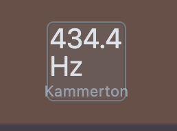
    - wenn `knob`s Gestalt=ohne ist, soll BG .. nunja: den BG der Value anzeigen.

-- 
20260722_152438
    Poly-Synth/Keyboard gruppe
        zwei buttons dazu: +, -
        sie schalten den akkord (live) ± Halbton
    
    fließTextansichten (alle): Markdown
        Hast du mir eigentlich geantwortet? Ich wollte wissen, wie kompliziert es ist, mit Markdown hier zu arbeiten. Bei Instrument Hilfe hast du es ja schon ganz gut eingebaut. Genau so würd ich es auch für die Controls als auch alle anderen Fließtexte haben. 
        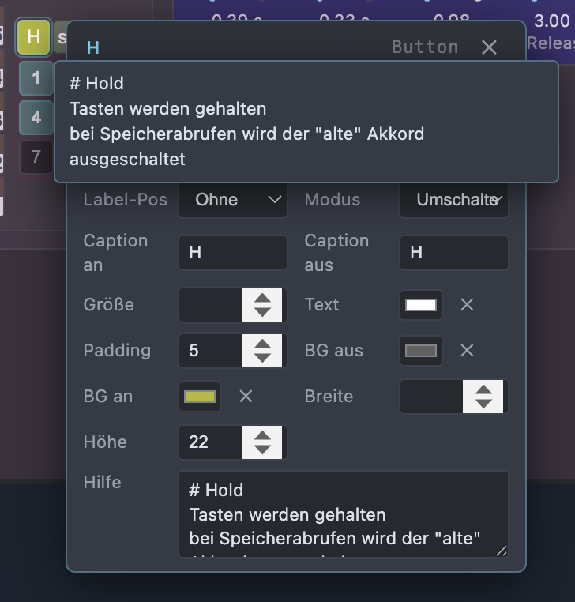 zumindest #, *kursiv*, **fett** 

-- 
20260722_155726
    zu Deiner Zusammenfassung:
        BaseKeyboard-MIDI:
            Hast Du völlig recht.
            "Noten per MIDI direkt die Basis-Tonklasse setzen lassen." ja, aber mit den gewünschten Einschränkungen: Bereich (wenn an, dann ist die Oktave, in der man Midi gelearned hat, die aktive Oktave. darunter und darüber ist dann ignoriert
        Control-Konsolidierung:
            Ok! dann nicht. Aber immer wenn ich eine Tastatur irgendwo einfügen will, sollte man zunächst von 'Keyboard von Basefreq' ausgehen können.
    'Meter'
        hat immernoch ein "festsitzendes" ISM an der Backe. Man kann das Meter-Ism nicht verschieben, deswegen breitet es sich wild aus, wenn ich Meter (gruppe) verschiebe. Bitte löse das Problem: Ich will sichtbar kein ISM, nur von der Kathegorie her ist Meter ein ISM, das Ausshen (auch im e-mode) kann völlig ohne ISM auskommen, lediglich das control soll man schieben können, ohne extra BG, ohne extra Größe - das macht alles Meter-Settings
    Polysynth/Keyboard/MidiOktave:
        das soll in 
    Polysynth/Keyboard/Speicher:
        - mouse Over uber den Speichern soll die gespeicherten Noten auf den Rahmen der Keyboard-Tasten anzeigen
        - bei learn modes: wird der **Speicher** verschoben 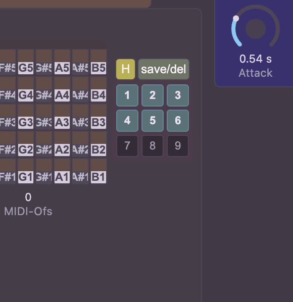 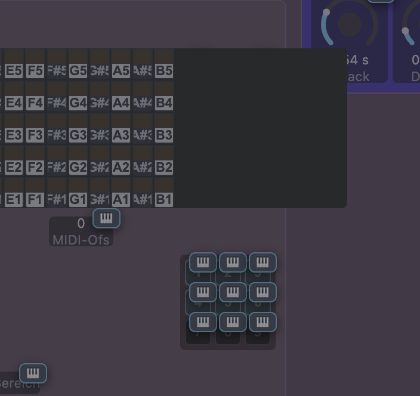
        - die gesetzten shortcuts funktionieren nicht (die 9 speicher gesetzt auf i o p k l ; , . / - kein einziger sprich an)
        - **Keyboard**: auch gut zu sehen: learn macht es breiter hat aber kein learn <-- muss einen besonderer Learn kriegen mit den Einstellungen Midi-Offset (in okt) und Bereich
    Polysynth/Base-Freq/Quelle=Tempo:
        sollte "live" geuptated werden (tut es noch nicht)

-- 
20260722_172315
    "BaseKeyboard-MIDI" / Speicher-Layout-Sprung:
    andere Ordnung/sizes bei aktivem **learn** (nicht e-mode!):
        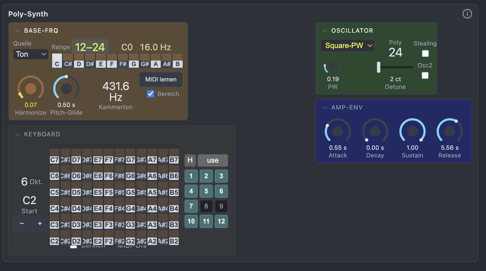ich habe Poly-Synth angeordet, die Control Positionen liegen geordnet
        und dann bei aktivem "learn" (beide):
        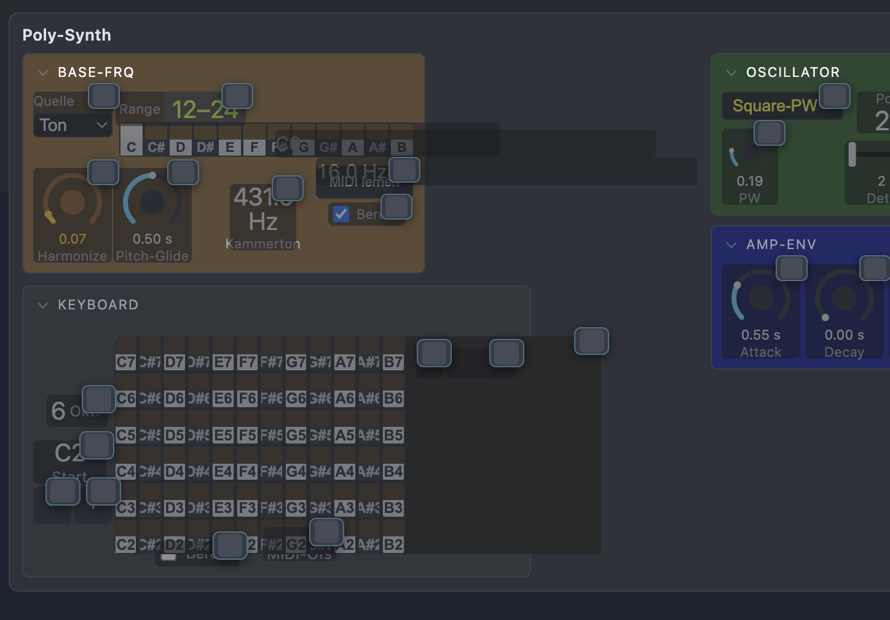
            - Control Verschiebungen
            - Control Vergrößerungen
            falls Du das nicht sehen oder berechnen kannst, sag bescheid. Ansonsten: bitte beides fixen: an Positionen und Größen sollte sich bei "learn" ichts verändern!
    synth/Keboard/Keyboard
        /Tastaturlabels
            ändere in diesem Keyboard: die **Oktavangaben** nur bei **C** (z.B. C2, C3..), die **anderen Tasten ohne oktave** (z.B. D, D#, E ..) das spart uns zusätzlich 1/3 Platz
            trotzdem sind sie noch wenige px zu groß (-2px oder -4px?)
        / @Midilearn:
            - das KB reagiert auch wenn ich nichts gelearned hab (fehler)
            - zu "PlayKeyboard-Learn: eine Note im normalen MIDI-Overlay kalibriert kbMidiOffset — kein Extra-Button, wie gewünscht.":
            Die Controls Midi_Ofset und Bereich sind noch da.. sie sollen in (den speziellen) Midilearn fenster.. (das ist noch nicht der Fall)
            - Das Kb reagiert auf die von BaseFreq/Keyboard besetzten Noten, das darf es nicht. **Grundsätzlich** sollten alle Midi remotes **nur einmal vergeben und genutzt** werden (dazu gibt's ja das Ausrufezeichen (wie bei Tasten funktioniert)
            - Keyboards und andere "controls die mehr als (ein) On und off haben bitte aus Tasten learn ausschließen

    OSZ: **Detune und OSC2** ist noch nicht 'live' (verändert sich nicht direkt)
    Poly=12 - nur 8 Voices?
    Poly=16 - nur 8 Voices??
    Poly=24 - 8 Voices! BUG!
    und die Stimmung (Range und Harmonize) kommt auch nicht mehr durch.. hä? das ging doch .. ich versteh es nicht.. hast Du eine Idee

    Umbau von synth/Keboard/save/R:
        es ist ein besonderer Button. "BG blink" (bzw. der dritte Mode) hat nichts in anderen Buttons zu tun.
    
    gutes Zeichen: Ich brauche Snapshots :) 
        
-- 
20260722_194404
grünes Licht für "Midi-Offset/Bereich ins Lernfenster verschieben + Multi-State-Controls aus Tasten-Learn ausschließen"

neuer Config-Export ist da /Downloads
dann weiter mit R-Button: 
    ein neuer Control ein besseres kürzel für `wechselButton`:
        settings: für `n` als int>0
        ein üblicher Button, nur in `n` modi. 
        Es gibt eine Tabelle, deren reihenfolge man ändern kann: jede `n` eine Zeile:
        |`n`|[Caption]    |[farbe]    |[(KI-vorgefertigte aber editierbare) Kurzbeschreibung der Funktion|
        Die Menge und Funktion wird durch die KI gegeben, aber das design incl. der Reihenfolge.. das kann man so nun auch spontan :)
    "`wechselButton` - R" speziell:
        |1|use|..|speichert in leere Fächer und ruft die gespeichertn ab
        |2|over|..|überschreibt auf jeden speicher auf den man clickt mit dem aktuellen Akkord
        |3|kill|..|jeder click auf Speicher löscht ihn
        verstanden?
        

-- 
20260722_203201
    "2. Midi-Offset/Bereich"
        bei dem Kb in BaseFreq finde ich noch immer kein MidiLearn, da soll es genauso rein wie in Keyboard/Keyboard! 
        und btw: dieser "MIDI lernen" Button ist doch überflüssig - weg. es soll über Midi learn funktionieren
    `wechselButton`: 
        - n brauchts nicht, das ist Background. 
        - Es gibt noch keine normalen Button settings! Settings wie beim normalen Button! 
            - von Button alles außer Modus
                - die Capations und BGs sind Teil der Tabelle
        - die Farbenwahl wird gewandelt in die Werkbank eigene
        - die Helps wie immer: mit vergrößerungs-untenrechts-ecke und mit **Mouseover INHALT des Textes** nicht 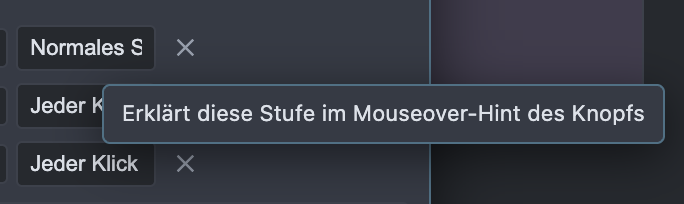!
    - neues ISM Stepsequenzer:
        - Stepsequenzer, Basisclock (n*BaseFreq) mit Teiler (Clock/n) als trigger source
        - Erstmal aus teslacoil "rüberkopieren" und technisch einbinden
        - freie Seq-Daten wahl:
            - Anzahl Steps
            - off
        - er kriegt ein Output selector
            - die kriegen im Moment 
                - AmpEnv mit OSZ (0,1-99)
                - /Keyboard-Speicher (1-n)

-- 
20260723_004305
Hi Opera, Ich hatte nun viele Chats mit Sonnet an der Werkbank. Jetzt ist aber einiges im Argen (s.u.). Ich will dass Du Dir das Projekt nochmal nach veralteten oder überfrlüssigen Dingen durchsuchst, die Gedanken von Sonnet durchschaust und prüfst, alle infos worüber mal wieder updatest und FlüchigkeitsFehler ausbügelst.
Für Opera:
Kann jedes ISM seine Latenzzeit angeben?
Können wir ein "Struktur Ansicht" bauen (wie 'Kette' in teslacoil nur mit mehr Verbindungen und Freiheiten) um den flow zu durchschauen und zu verändern?

20260722_233428
Ich brauche ein header Reset Button
    der alles zurücksetzt

Midi Learn bei den Keyboards:
    Fuck! da ist gar kein Midilearn dabei?!?? die Funktion wurde wissenlos eingebaut.. schwach! Es geht hier um "Midi learn" und hier quasi mit Filterung (Bereich) aber learnen muss es trotzdem (z.B. welcher MIDI-Ch)! 

    und noch ein fetter Fuck:
ISM: 
    Du nutzt ein veraltetes ISM Konstrukt! Hast du die Lib nicht aktualiisiert??  Das ist jetzt zuviel fuckups.. hier muuss erstal alles in Ordnung gebracht werden..
Metronom ist nicht mehr zu hören.. (braucht auch die Struktur)
Und Oscillator und spektrometer als extra module..

Der Stepsequenzer Gruppe:
    Hier sollte das modulare werden Aus- und Eingänge Automatisch anbieten und verknüpfen (listen für in- und outputs zur Nutzung/Weitergabe):
        - AmpEnv  (0,1-99) 
        - OSZ F
        - OSZ P
        - Keyboard/Keyboard-Speicher (0,1-n)
        - BaseFreq-Töne (0,1-12)
        - 0 soviel wie nichts/kein einfluss/laufenlassen
        - >0 Ausgabe/GateOn/Wert
    - Das mit Teiler hat null funktioniert.. frag mich wenn Du nicht mehr weist wozu sie da sind
    
    zunächst 3 Sequenzer davon bitte

bitte plane gut und Detailiert zum erfolgreichen Projekt mit Sonnet und Opera

-- 
20260723_124045
ok, Phase 4 gibt's noch.. argh! 

nun nach dieser ganzen aufwändigen 3 Phasen ..:
    - funktioniert alles wie vorher: scheint so (👍🏻)
    - Sequenzer ist immer noch in einem veralteten ISM Hülle! Das halte ich für SCHWACH!! Du müsstest dich beim durchschauen merken müssen, dass der Sequenzer nicht mit den anderen ISM übereinstimmt?!? 
    - der "Teiler" soll VOM TRANSPORT DIE SCHLäGE üBERNEHMEN. - Derzeit läuft alles verkehrt
        - der Multiplikator macht schneller (soll vervielfachen)
        - der Teiler.. bei 1/16 ist es ""~etwa"" der Beatschhalg (mit Metronom verglichen) es soll aber bei 1/1 GENAU dem Beat entsprechen!! dass ich das erklären muss ... 
        - Der Sequencer ist Null (0)  mit dem Tempo, Start, Sync verbunden !! soll er natürlich!! bei design!
- Struktur:
    - als popover - gut!
    - mit den überdeckten Kabeln - kein Porblem soweit, wenn man..:
    - alle Module sollen verschiebbar sein, bzw. deren Ein- und Ausgange veränderbar, so dass man z.B. Rec direkt an OSZ stecken kann, oder Stepsequ wo andershin verbinden kann (wenn möglich) = ein Modularer Synth/Werkbank!
    - dem Struktur Fenster ruhig mehr Platz geben..
  
ok mach mit Phase 4 weiter

20260723_134400
"Damit ist der Sequenzer jetzt mit Tempo, Start und Sync verbunden"
..aber '!' und '!!' funktionieren noch nicht.

und der unten Text im Sequenzer ISM und das fehlende 'i' rechtsoben zeigen mir, dass Du ISMs nicht einheitlich hast. Warum?

-- 
20260723_142755
räum bitte auch den Ordner werkbank auf (bilder)
**! funktioniert noch immer nicht!! Der Sequenzer läuft einfach weiter langsam wirds peinlich.**
!! funktioniert, immerhin, **aber dann bleibt der erste trigger 2 Zählzeiten auf erstem Step**! Man eh!! Was ist das für ein scheiß?!?!? in teslacoil ging das zack zack.. alles funktionierte direkt.. hier in Werkbank - nach einem 4 phasigenm allumfassenden, sehr teueren Restaurations-Durchgang ist der Sequenzer (das neuste ISM) so anfängerhaft..?? Was ist hier los??

--
