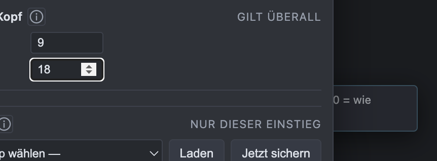
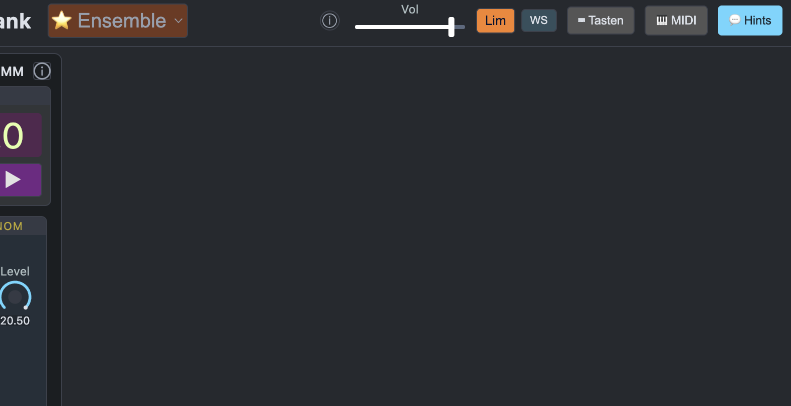
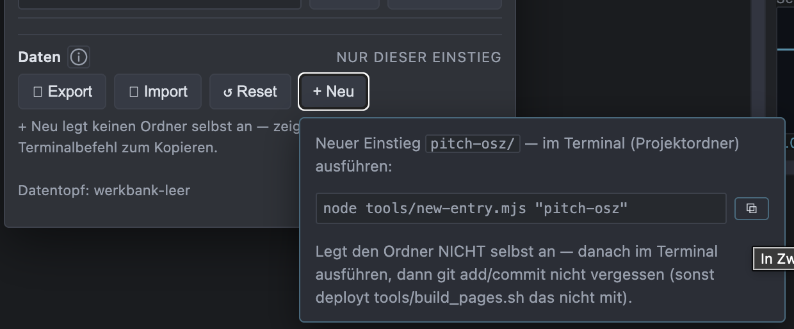
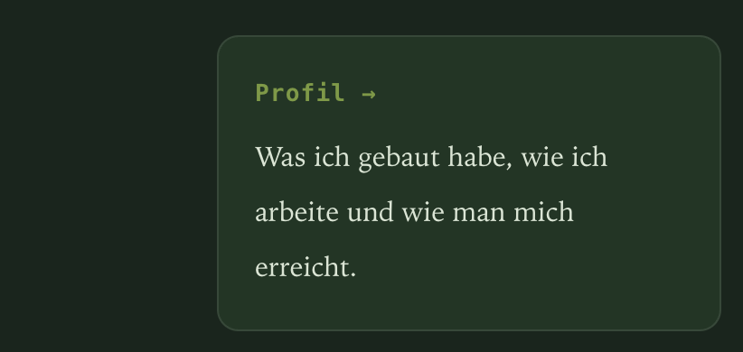
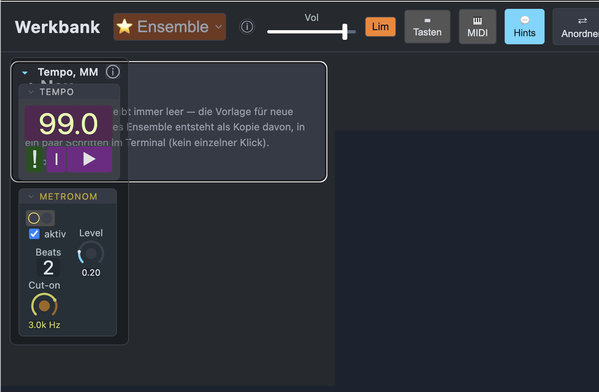
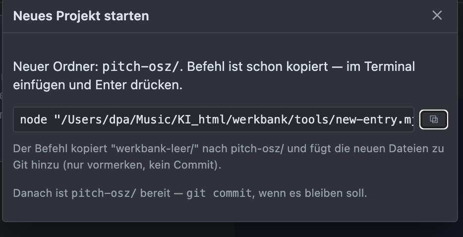

zur Migration:
    bis auf den letzten Punkt ("Prüfen, ob irgendwo..") klingt das so, als wäre das über ein Skript machbar. Das müsste direkt beim <Erstellen der Kopie> (auf dem Panel!) = des neuen Ordners passieren (Zum Beispiel: man hat 'werkbank-leer', was leer bleiben soll, und will es als 'PitchOszillator' kopieren damit man halt frei mit frequenzen, oszillator usw. rum probieren kann, und eiin eigenes Ensemble bauen kann..) klar muss das an einer stelle irgendwie mit skripten durch exerziert werden, dass die Kopie im neuen ordner 100 prozent auf 'sich selbst' läuft. Das muss ich möglich sein..? mit gut durchdachten subagenten? 

ohje.. es rollt eine Buglavine über die ADSR implementierungen:
    - 'Amp-Env' Combo gespeichert, in der ADSR diese gespeicherte Combo geladen.. (außer der Farbe) sehen sie nicht gleich aus..
    - es fehlt auch in der 'Amp-Env' diverse Settings (Modus, LenEinheit) und 'versteckte' sind nirgens (in den Settings) zu finden.. **das ist noch keine echte ADSR!**
    - 'Peak' wird in der ADSR mit k angegeben, Mittenstellung ist 500k? normal ist min 0 max 2 default 1. Das kann man sich auch selbst einstellen, aber bei einer neuen Env ist es diese peak einstellung einfach praktischer.
    - Peak der Envelope ist (!!schonwieder?!?!?!@#!$!?) auf max 1 gelimmittet??? Diese Begrenzungen habe ich schonmal ausführlich, umstandlich, teuer von Dir entfernen lassen!! Die sind wie Schimmel kommt überall wenn man nicht höllisch aufpasst?!?!? Du sollst dinge wie Peak auf 1000000 o.ä. limiten!!!! merk Dir das einfringlcih!!!!!!!! FUCK! Merk dir dass limits ≠ (NICHT!) default ist!!!!##!@!#!#!@#!!!!!! fuck!!)
    - Gate In kommt von einer Seq mit [1,0,0.5,0] in die ADSR. 0.5 wird nicht erkannt, alles gleichlaut. FALSCH! Es muss immer max. envelope GateOn-wert * Peakwert sind

20260802_150742
"vermutlich ohne Nullpunkt/TrigMode/Output, die für eine fest verdrahtete Voice-Amp-Hüllkurve keinen Sinn ergeben"
kann das nicht der User entscheiden, was keinen Sinn ergibt? Nullpunkt einfach 0 lassen, dann ist der Nullpunkt als Control da, aber ist auf default=0.. so what?
Du sollst beim Umbau auf die ADSR keine workarounds einbauen müssen, einfach die ADSR rein, ich mache den rest. ok? einfach nur auswechsel, In+Outs verbinden, ich mach den Rest (scheiß auf alte Snapshots) - OK? 
"Amp-Env bekommt dieselben Keys/Knobs wie ADSR (Peak, GateLen/Len, Modus, LenEinheit, Kurven, Skew") JA! alles von ADSR einfach rein! Wenn es nicht so einfach geht, wie ich mir vorstelle, dann baue es zurück auf die Original Amp-Env.

Als nächstes kommen die Ein- und Ausgänge. lass uns grillen:
    - Eingänge sind ja die 'Ausgabe-Ziele' (derzeit für SEQ, ADSR, später LFO, multiEnv usw.) - da haben wir schon eine gute Menge (alle mögliche Controls usw) - super. 
    - Bei Outputs siehts dünner aus (derzeit: 3 siehe Scope Eingänge). Dafür wären potentiell andere Outputs gut, um sie "abzuhören" (z.B. am Ausgang mit 'Output' )  oder zu debuggen/prüfen (Scopes), oder vielleicht auch verschieben zu können (wie in teslacoil: die Module in der "Kette" verschiebbar sind).. 

20260802_152538
mir ist etwas durcheinander gekommen.. bitte prüf ob Du die Punkte schon gemacht hast, und wenn nicht sind sie neu:

    ADSR (ex Amp): 
        Button '►' zeigt nicht (mehr) Gate input an (Gate>0=On/Off reicht)
        
        kann ich eine Combo als defaulteinstellung vorgeben, nicht immer, nur jetzt als Einbau der defaults? Bei Seq und ADSR wäre das sinnvoll, da hätte ich schon Combo 'Seq0' (dürfte in den lezten json dabei sein). Für ADSR brauche ich noch Control 'Fest' in der (standard) ADSR

    "„Outputs dünn" = die 3 Scope-Eingänge als einzige Abnehmer, Verschieben = Signalfluss-Reihenfolge wie bei teslacoil. Sag Bescheid, wenn ich damit anfangen soll." --> BESCHEID!
    Limiter: 
        da must du nochmal ran: das clipped quasi immer wenn es auf 0dB limittet, was den Limiter quasi sinnlos macht. Ich will zunächste das Signal anschauen können (via scope). um dann zu entscheiden was da clipped Anschlüsse müssten dafür vorhanden sein, siehe oben.
    Scope: Usageverbesserung:
        Scope selbst hat in Settings ja eigentlich nur Frame/Sample Umschalter, alles andere ist in Scope- Gruppen Settings. Diese beiden Einstellungen vereinen, oder auf dem Scope NUR die vollständigen Scope einstellungen (Buffer, Höhe,..) und in der Grupper nur die stndard Gruppen settings? 

    Config: 
        - zwei Icons im Button das erste kann bleiben
        - Daten Export: den gleichen, gestaffelten wie in teslacoil
        - verschiebbar machen (über header drag)
        -  der "Hintergrund" ist abgedunkelt - soll es weniger sein
    Gruppen: Ansicht: header
        - bitte fablich etwas zum Rest absetzen, und mit (sanftem) Mouse over
        - die header Vorgabe von Settings passt noch nicht richtig. Ich habe z.B. größe 8 und Höhe 0, sieht immernoch groß genug aus. Ich meine.. zu klein darf es nicht werden, aber kleiner als normal schon! einfach befolgen (die LIMITS RAUS!!!!!!!!!!!!!@!#@!!@##$!@#$@#$) und dem User überlassen!

    zum Arpeggiato: Deine Notizen:  
        "mein Fix braucht 62ms (ø 1,5ms/Note). Jetzt die Testsuite laufen lassen."
        das ist doch auch noch viel zu vie! geht es nicht sample (oder wengistens Frame-) genau?? 
        .. erstmal hören.. 
        ..
    ADSR: "jetzt auch für Fest): 62ms total (ø 1,5ms/Note" 
        man hört es kaum, aber es klingt ganz schön.. lahm.. ich hätte eigentlich Sample- (oder zumindest Frame-) genau erwartet..
        Modus: nix (an den kann ich mich gar nicht erinnern..) Der schaltet das Gate ein und aus.. hm. ok.. warum heißt das 'nix'?

"Button '►' Gate-Anzeige: die Preview-Funktion (Klick spielt Referenzton) ist neu von mir gebaut, hat aber KEINE optische Gate-Anzeige. Das ist ein separater, noch offener Punkt."
    Ich meinte etwas anderes: Bei hereinkommenden Gates, die die Env trigger/gaten, soll der Button an und aus geschaltet werden - das Gate sichtbar gemacht. mehr nicht.

Lim:    
    - bei Att=0 müsste es eigentlich mindestens an einer stelle knacken. da ist noch etwas zu langsam!
    - bitte den Lim Button neben Attack und Release (geordnet nach Limiter settings und Optik): BGoff, BGon (und der Vollständigkeit halber auch VG/schrift)

Ich dachte gerade an ein mini predeay für das zu liimittende Audio (was dann von vorherein etwas früher abgespielt  wird, so dass es korrekt in time rauskomt.. das mit den Latenzen hatten wir ja schon eingebaut.. da müsste man die -Delayzeiten (erste Quelle entsprechend früher) recht "einfach" einstellen können..? (das wäre etwas für Opus) 
Damit hätte man "genügend" Zeit für den Attack (der auf korrekte minimum Zeit (eben nicht 0) herunterregelt und mit einem predelay die Spitzen abfängt...

"Ein Predelay VOR dem Limiter bringt nichts. Der Compressor sieht dann einfach das verzögerte Signal u"
Nee. Missverständnis!
Man verzögert nur einen Teil in dem Limiter. Und zwar der, der den Peak angibt. Der andere (leicht verzögerte) wird dann von dem Limiter gelimitet. damit die Verzögerung nicht hörbar ist, muss diese ganz vorne (Gates und trigger) nach vorne verzögen werden, So dass am Ende null Zeitsprung rauskommt. Verstehst du? 

WaveShaperNode
Klingt interessant, bau es gerne ein mit ein/aus-Schalter. 

20260802_200509
Ringpuffer! genau!! jo geil! Der ist die Lösung für die "Kette"/n, da kann man beliebig ein steigen, man hat eine zeit/Samplezahl in welcher zeit man zugreift! 

WS Button erzeugt direkt Verzerrung. trotz Limiter! Da ist noch etwas mit dessen Lautsärke.
Der Wunsch Dir ein Debug übergeben zu können ist gerade groß, deswegen zusätzlich oder extra session oder subagent, entscheide Du: bei teslacoil die debug Gruppe.. die will ich auch in beiden, werkbank-leer und overcord.

Notiz für mich :
Verstanden – der Knick kam vom Umschalten zwischen linearem und tanh-Stück (Sprung in der zweiten Ableitung an der Nahtstelle). Ich baue stattdessen eine einzige durchgehend glatte Formel mit dem x^1.7-Exponenten: die "inverse Potenz"-Sättigungskurve y = x / (1 + |x|^n)^(1/n) – bei n=1 der klassische einfache Soft-Clipper, für n→∞ nähert sie sich einem harten Clip an, n=1.7 liegt dazwischen. Slope bei 0 ist analytisch exakt 1, ganz ohne Bruchstelle.

`Note` hat noch kein Icon für die Panel-weg --> Settings Anzeige
Scope: 
    die Umschaltung Frame/Sample führt immer zu einer minifizierung der Ansicht. es soll sic h seine größe merken können. Und: Zeile 33f
    
    Außerdem auch Zeile 36-43
    
    und ich brauche noch enien header Button für den e-Mode
    alle header Buttons sollen Button Settings, key- und Midilearn haben 

20260802_234615
    header:
        WS soll in Lim (settings) mit rein
    main Settings:
        - Gruppenkopf
          - Größe: help hintern Fenster     
          - BG Farbe für Gruppen header fehlt
        - Farb setting für Ensemble BG  
        - ein bisschen kompakter wäre doch ganz nett
        - Backups (endlich da! thx!) der Text gehört in die {i} hilfe (btw: auch da bitte keine Romane und nichts über selbsverständlichkeiten (etwas wie "Größe ist die Schriftgröße, Höhe eine Mindesthöhe in Pixeln — 0 heißt „so hoch wie der Text es braucht"." ist fast komplett überflüssig, weil wohl bekannt! Sehr informativ ist hingegen der Text (Automatisch gesichert, solange sich etwas ändert (gestaffelt: max. 2/Min, 5/Std, 1/Tag, 1/Woche). Ein Backup zu laden ersetzt den KOMPLETTEN Zustand dieses Einstiegs.))
        - fehlt noch der "ins neue Projekt starten" worüber wir schon geredet haben: die leere Werkbank in einen neuen Ordner- und Projektnamen mit allem nötigen script und file Umbenennungen für das neue eigene Projekt (wie overcord)..
    Outs (für scope):
        viel zu wenig, bitte diverse Outputs hinzufügen (controls nicht, aber Ausgänge aller art (envelopes, OSZ, ..) 
        
Das mit dem preDelay (am Beispiel master Lim) haben wir noch garnicht zuendagebracht. Der Ringbuffer steht ja, bitte füge ein PreDelay knob in Lim hinzu

Rec-Format:
    - kann eigentlich mit in die Settings
    - Sollte sich debug an Rec-Format halten? Oder ist das kontraproduktiv für die KI? 

20260803_11

das ist zu durcheinander! man hat im Config einen Button der nach nichts aussieht (+Neu) aber sehr viel Informationen braucht. Gedrückt und ernannt kommt ein zweites Fenster mit wieder unklaren Informationen und ein terminal Befehl (image-8.png), bei dem doch cd .. fehlt oder kann man diesen Befehl `node tools/new-entry.mjs "pitch-osz"` einfach in irgendeinem Ordner ausführen? Nein! Das ist weder erklärt noch automatisch. Das ist alles sehr sehr unklar!

"Legt den Ordner NICHT selbst an — danach im Terminal ausführen, "
Hä? Was ist das für eine Info: etwas tut nicht - danach soll man..??
"dann git add/commit nicht vergessen"
wtf! das kann man keinem User anbieten!
"(sonst deployt tools/build_pages.sh das nicht mit)."
sonst ..was?? Müssen die User erst Computertechnik studieren um diese Worte zu verstehen..

Nee.. das ist ein Chaos, bei dem jeder Fehler macht. 
Das müssen wir von vorne durchdennken..:
Was kann noch automatisch geschehen: 
- den html-Pfad selbst kennen und darin arbeiten
- cd ..html-Pfad mit in den Terminal befehl
- Vorgang im Vordergrund 
    - (extra Fenster nach +Neu drücken) separat.
    - klare Hilfstexte mit anschließendem Copy (oder besser:
    - so viel wie möglich automatisch!:
- in werkbank-leer: der Vorgang "+Neu" vielleicht in der Mitte als zentrales "ism" (ohne dass es ein ISM ist, nur wegen der Lage so beschrieben), mit eine klare Info/Aufforderung: das ist das leere, was immer leer bleiben muss, von hier aus startet man neu.. indem man.. [Infos]
- ich denke an einen Zentralen Button so ähnlich wie : 
  - (nicht die Farben, nicht der Text, sondern)
  - Überschrift (größer als Bsp) "+ Neu"
  - darunter die Erklärung warum 'neu' überhaupt und dass das etwas aufwandiger ist.
  - beim click auf diesen großen Button öffnet sich dann das besagte Extrafenster..

20260803_122138
viel besser! 

    -  mittiger!
    - nach diesem : vielleicht gleich ein (halbautomatisches) "öffne [neuer ordnername html]" im gleichen Fenster?
    - die zentrale mittige NEU auf dem Panel NUR in WB-leer. im neu erzeugten dann nur noch als "Copy to new html" o.ä. in der Config (ähnlicher Vorgang, aber nich als "neu" sondern als Teilung/Auslagerung..

20260803_123707
weiter im Sonsitgen (WB-leer UND overcord):
    