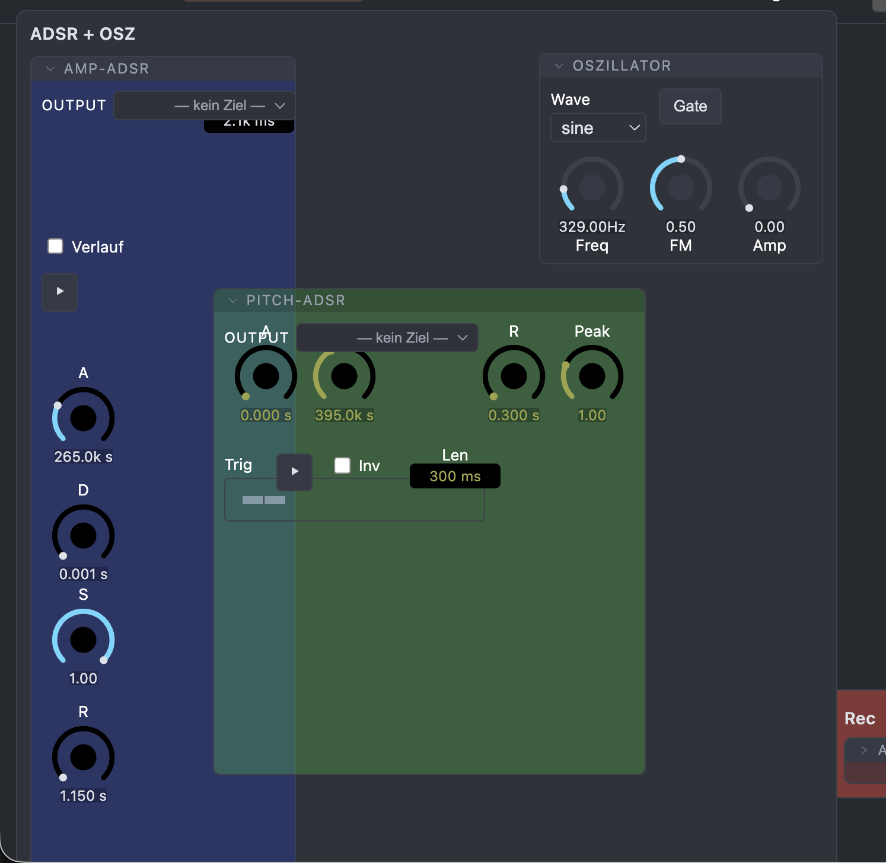
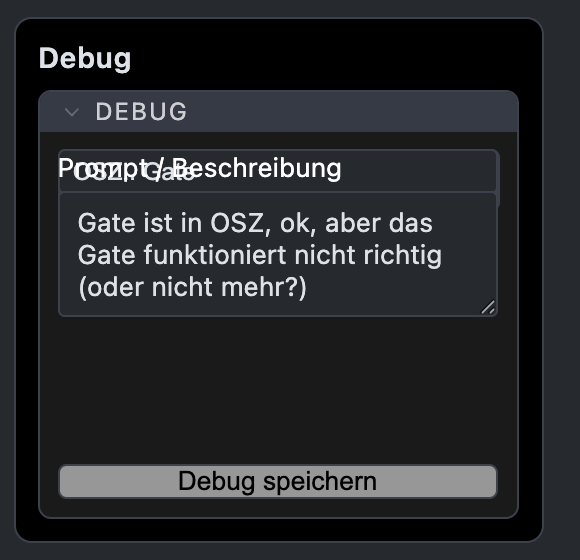
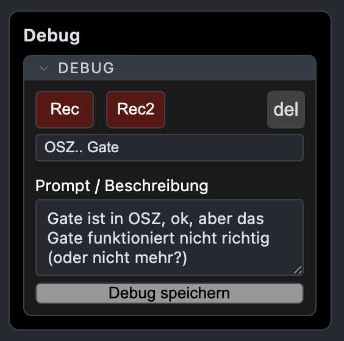
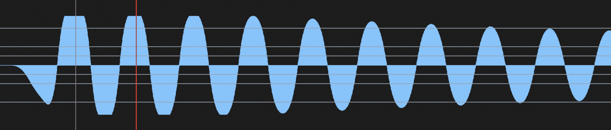

"phase2_routing_smoke.py/werkbankLeerEntry_smoke.py auf rec_0 statt rec angepasst. Fünf andere Tests (sqTargets_all, ensembleSnapshot, scopeSampleAccuracy, i18nLabels, hintTranslation) schlagen fehl – per git stash-Vergleich verifiziert: bereits auf dem unveränderten Merge-Stand kaputt, nicht durch diese Aufgabe verursacht."
und
"6 Smoke-Tests sind nachweislich seit vor dem heutigen Umbau rot ..."
Diese fehlgeschlagenen Tests werden immer mehr und verursachen einiges an zusatzlichen 'Runden'. kannst Du mal diese fails irgendwie auschalten/ausschließen/fiixen?

"Die ~1-Frame-Sound-Latenz bei adsrOsc (voriger Nachricht) – braucht dein Ohr."
ok.. wo? wie? was? Grundsätzlich (ohne zu hören, nur die Regel): verzögerungen werden über negativ-Latenz für den Grund diesen Zweiges 'herausgeholt'. Bei einer ADSR z.B. ist das Gate/Trigger die Quelle, dieses muss entsprechend früher (nur für diesen Strang) geschehen.. alles andere bleibt in time (oder auf deren latenz). 
"bei der Migration Singleton→Instanz-0 werden ctrlPos/controlOrder (Position innerhalb der Gruppe) nicht mitgezoge"
was ist "Singleton"?
".. nur ggf. die Gruppen-Anordnung nach dem ersten Reload seit dem Update."
ja das kenne ich gut: wenn Du Gruppen neu erstellst, werden sie sehr simpel und groß dargestellt . Dafür gibt es Combo. Von diesen Combos sollen später "factory-einstellungen" zur verfügung stehen, die bestimmte einstellungen, Größen und Anordnungen zur Verfügung stellen. Natürlich hätte ich auch gerne eine definierbare initial-Einstellung bei neu erstellen dieser Groups..

Andererseits gibt es noch einen anderen Bug, den ich bei diesem Thema gleich mit ansprechen will: es gibt initial Einstellungen, wo die Gruppe oder das Instrument zunächst noch nicht richtig dargestellt wird , man muss kurz in den e-mode und wieder raus - dann stimmt es  (den Text auf den Bildern bitte ignorieren! es geht mir um die andere anordnung und fehlenden RECs usw.)

apropo e-mode: der Tastaturshortcut ist für e-mode (='e') festgelötet, das muss er nicht mehr, weil es einen "learnbaren" header button dafür gibt. 

-- 
ich habe am Di ≈54% meines wöchentlichen Token Budgets verbraucht ..bis Sonntag! Das ist eindeutig schneller als der Zeitverlauf, deshalb muss ich irgendwann pausieren. Kriegen wir es hin, in den restlichen .. 46% alles so zu dokumetieren und zu fixen, dass eine "fremde" KI (z.B. deepseek) mit einer 'Werkbank-leer-html-kopie-ordner' mir etwas funktionierendes bauen kann? 

prüfen: Lim: 
    - das audio Signal für Attack muss |x| (=der amplituden stärke) sein
    - der Ausgang wird, ob '+' oder '-'  gleich behandelt

procclean
außer "ADSR-Gruppe-Bug in pitchosc/index.html debuggen"

Sonnet 5. Zum Lim/Output-Limiter: schon korrekt, nichts zu fixen.

Beide Punkte aus deiner Checkliste sind in lib/audio/limiterProcessor.js bereits erfüllt und ich habe es nicht nur gelesen, sondern nachgerechnet:

a = s < 0 ? -s : s (Zeile 120) – der Peak-Detektor nimmt tatsächlich |x|.
Ad-hoc-Test mit +1.5 vs. −1.5 als Eingang: Ausgänge sind exakt antisymmetrisch (outPos[250]=1.0205, outNeg[250]=−1.0205, Differenz 0) – Gain-Reduktion behandelt +/− identisch, nur das Vorzeichen bleibt erhalten. Bestehende 23 Tests bleiben grün.
Zur Budget-Frage – kurze Einschätzung, keine fertige Entscheidung:

Doku für „fremde KI baut selbst" existiert schon genau zu diesem Zweck (CLAUDE.md/ARCHITEKTUR.md/CONTROLS.md, extra dafür geschrieben) – aber der heutige Tag zeigt: pitchosc war exakt dieser Test, und trotz Doku kam „mangelhaft" raus (Ports vergessen, groupKind/Settings-Hook nicht gekoppelt, Popup-Overlap). Reine Doku-Vertiefung würde das vermutlich nicht beheben – der eigentliche Hebel wäre, die "Pflicht-Rückfragen"-Checkliste in automatisierte Wächter-Tests zu gießen (wie es hintTranslation_smoke.py/i18nLabels_smoke.py schon für i18n tun), die genau die heute gefundenen Fehlermuster (Ports-vs-hartverdrahtet, groupKind-Kopplung) mechanisch abfangen. Dann kann externe KI mechanische Gerüst-Arbeit übernehmen und die Prüfung ist billig (grün/rot), statt dass jemand nochmal alles liest.

Trade-off: heikle Sachen wie heute (Timing/Latenz-Bug, Merge-Konflikt zwischen zwei Umbauten) brauchen weiterhin einen sorgfältigen Prüfer – da würde ich nicht blind auf externe KI + Wächter-Tests vertrauen.

Soll ich mit den Wächter-Tests anfangen, oder hast du eine andere Priorität für den Rest des Budgets?

20260804_182528
viele Coments (gut, ABER:)
    Ich habe die Werkbank gesehen, wie viele Kommentare da drin sind. Das ist teilweise ganz gut, aber teilweise beschreibst du da vergangene Dinge, zum Beispiel 
        "
        // WS hat KEIN eigenes Learn mehr (@dpa ddw.md 20260802_234615 Punkt 1: WS zog ins Lim-
        // Popover): die self-Panel-Mechanik braucht ein dauerhaft sichtbares Element zum Andocken,
        // das WS als Popover-Zeile nicht mehr hat — offener Punkt, s. Abschlussbericht.
        "
    So was macht keinen Sinn, oder? die kommentare sollten das beschreiben was 'da ist', oder schreibt so, dass man den Code durchschauen kann. Aber nicht durch Zeug aus der Vergangenheit Verwirrung stiften und Dinge erzählen, die nicht mehr da sind! Das hilft NULL. Alles was Vergangenes, vorheriges Beschreibt muss raus.

-- 
Lim: siehe debug /Users/dpa/Downloads/werkbank-leer_debug_amp_12_Limitertest (1).txt
WS ist geclipped auf max. -3dB (geschätzt) 

--
20260804_230902
schau mal in scope, wurde gerade frisch gebaut. ich will bei der Anzeige einen extra zoom, also man gibt einen Buffer z.B. 100ms ein und kann dann auf der Anzeige via mouse/touchpad zoomfunktionen rein und rauszoomen. Für touchpad gleich grunsätzlich: zoomen: 2-Finger sweep senkrecht: bei sync=on: auf den trigger, ansonsten bei der mouseposition ein (und aus)zoomen; bei 2-Finder waagerecht: verandert die zeitlicche Position (Beispiel: /Users/dpa/hass/sensor-archive/mac/index.html)

Sonnet 5. Zoom/Pan in lib/SignalScope.js gebaut: bufferMs bleibt die voll ausgezoomte Ansicht, Zoom cropt rein darin (nie mehr Zeit als bufferMs). 2-Finger senkrecht = zoomen (Anker: Trigger bei Sync-an, sonst Mausposition), 2-Finger waagerecht = Zeitfenster verschieben, Achsen-Lock ~140ms wie im Vorbild sensor-archive/mac/index.html. Doppelklick + der ⟲-Button setzen zurück auf voll ausgezoomt. Transient, nicht persistiert (wie Sync/Freeze). Alle vier Zeichenpfade (Sync-Ring, Freeze-Ring/Points, Live-Analyser, Live-Buf) über zwei neue gemeinsame Helfer (_drawRingCurve/_drawPointsCurve) vereinheitlicht, Trigger-Drag und Freeze-Hover-Readout aufs Zoom-Fenster umgerechnet. Bestehende Smoke-Tests (signalScope_smoke, signalScopeSyncFreeze_smoke) + node-Unit-Tests (triggerSync, taktgeber) grün.

