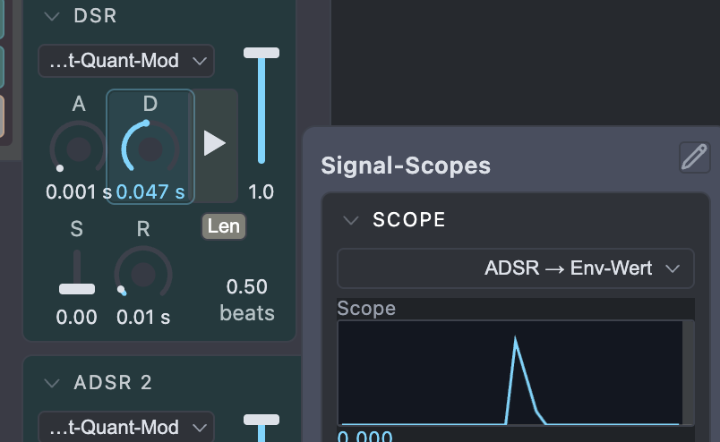
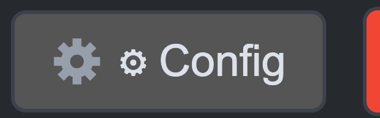
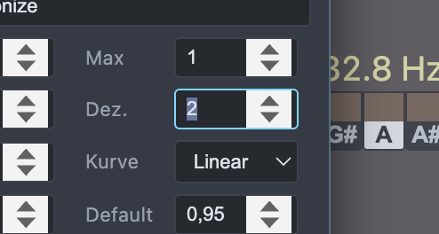
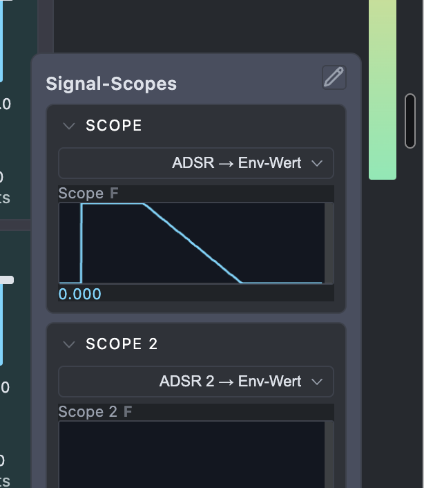
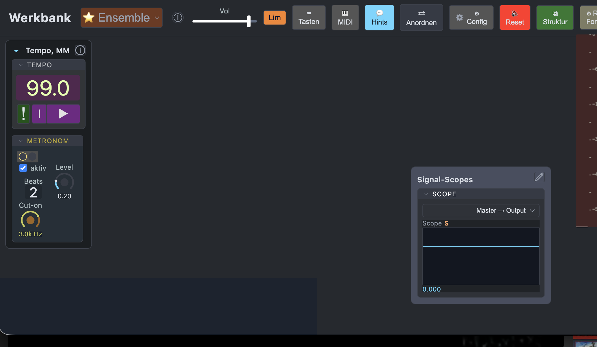
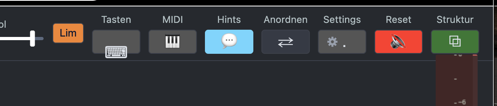

!: nicht für die KI, nur personlicher promptspeicher!

ADSR:
Die Settings sind zwar alle da, aber funktionieren teils noch nicht teils will ich die Struktur klären:
    Logik und Funktion: Gate Länge
        diesbezüglich vorhanden:
            `Control`s
                `knob` Len (beat länge?)
                `knob` GateLen (zeit lange?)
                `Button` (Gate/Trigger in)
            `Setting`s
                Modus[Gate,Trig]
                Len-Einheit
            `Ziel` bzw 'Moduleingang' von z.B. Seq (btw: funktioniert noch nicht)

        es braucht noch:
            Control `Button` 'Len: fest oder offen' (zwischen Control-ierter Len und "live" GateOff- gate ende)
        
        Der Controls Len und GateLen sollen nur erscheinen, wenn der 'Len..offen?'=fest ist. Dann werden die Gates mit der Zeit geschlossen, die man auf dem Panel angeben muss. 
        Es gibt aber zwei Controls für die Zeitlänge: 'beat' und 'time'. Von denen soll auch nur der Aktive (der wohl schon beide vorhandenen) erscheinen.. verstanden die Logik? das Panel frei räumen von inaktiven Elementen. 

-- 
Entweder kriegt die Env noch einen extra "Nullpunktversatz", oder Pitch reagiert mit *(1+Modulation)

"Nullpunktversatz":
    diei Env dreht sich immer um den Nullpunkt, um *ihren* Nullpunkt. Wenn jetzt ein Ziel aber um 1 herum arbeitet, zum Bsp. bei Frequenzen, dann braucht man einen Env-Nullpunkt von 1. Verstehste?

Bug:
    'Fest' schaltet noch nicht die Regler um (GateLen/*beatLen). es ist nur GateLen zu sehen

die Positionen der aller verschiebbarer Fenster sollen ihre Position merken wenn sie geschlossen werden. 

-- 
Bug: (der ist noch! das ist kein übrigbleibsel!!)
    'Fest' schaltet noch nicht die Regler um (GateLen/*beatLen). es ist nur GateLen zu sehen
    /Users/dpa/Downloads/Bildschirmfoto 2026-07-27 um 09.55.45.png
Bug2: lt. deinem Aktueller Stand ist das "+1" für Pitch ist fest in engine.js verdrahtet. Das past nicht, denn wenn man die Env zu ende laufen lässt landet man wieder bei 0! ABER:  dieser buggy Bereich kann wieder rückgängig gemacht werden, denn ich entscheide mich für 
Deine Empfehlung: Nullpunktversatz als eigenen Knob bauen (Default 0) aber!: --> als `Setting` (was man später vielleicht auf das Panel schalten kann.. siehe todos).

--
sauber! , jetzt kann ich die anderen feinheiten finden..
schau mal hier
/Users/dpa/Downloads/werkbank-config-20260727084922.json
das Release ist sehr kurz und das ende kommt oft **nicht** bei seinem Ziel (PostQuantMod) an. es blebt irgendwo dazwischen hängen..

Desweiteren habe ich ja den Seq 6 auf die erste ADSR geschaltet. Diese Sequenz sendet [1.5,0,1,0], bei ADSR scheint nur 1,0,1,0 anzukommen? jedenfals ist jeder Ausschlag gleich. es soll aber alles durchkommen:
envout = (EnvForm * (SeqOut >0) * Peak ) +Nullpunktversatz

Die  scheint mir hin und wieder auch etwwas ungenau: hier sieht man eine sehr kurze Env. sie zeigt bei jedem trigger anders, meist vergleichsweise lange Attaks, das Dec auch, ist kaum von lin zu unterscheiden..
und neben her wäre ein sync button, der bei den beat schlägen eine schwache senkrechte linie anzeigt und auch auf diese synchronisiert werden kann (extra Panel button: 'sync' und ein freeze button, der, wenn an, die aktuelle Ansicht des scopes einfriert und via moouse over alle werte auslesen kann..

im osm 'Rec' könnte man noch mit debug möglichkeit erweitern: aus teslacoil in werkbank rüber kopieren, und im bisherigen Rec ISM die Gruppe 'Aufname' (erstmal) raus und mit Debug ersetzen (aber selbstverstandlich mit den Werkbank elementen controls, gruppen, ism.. das ist hoffentlich klar?)

--
also die trigger kommen bei A≈0, D=0.01, nur ca. 7von 10 triggern durch, bei D=0.008 noch viel weniger. Das ist für die Env zu ungenau!

zum Scope: frame vs. samplegenau
ok, dann soll es beide versionen geben. In den Scopes Settings ein toggle 'Genauigkeit' [frame, sample] umschalten, mit einem "!" Icon hinweis bei Sample wenn es (viel)mehr CPU kostet. Die framebasierte Ansicht blebit default.
grill-me für offene Fragen

Bug
Der > Button triggert (plötzlich?) bei "release" ?? man drückt ihn - nichts passiert, man released ihn - trigger.. [in diesem config](../../../Downloads/werkbank-config-20260727094003.json)

-- 
"Offene Punkte, die dabei aufgefallen sind (nicht angefasst, da außerhalb des Auftrags):
test/adsrLenFest_smoke.py schlägt bereits vor diesen Änderungen fehl (vorbestehend).
signalScope_smoke.py und phase2_routing_smoke.py haben vorbestehende, unabhängige Fails."

tja.. da musst Du nochmal ran.. oder was meinst Du? wozu hast Du angehalten?

desweiteren:
ADR sind immer linear
die Kurven lin bei skew >1 (z.B. =2) sollen übrigens wie die Rampe [1 - 0]² verlaufen. bei kleiner (z.B.=0.5) wie ramp[0,1]^1/2. 
Bei log sieht es so aus, als würde es sehr steil auf die 0 zulaufen.. es ist mir klar dass bei sehr kleinen Werten auf 0 abgerundet werden muss wegen bitungenauigkeiten - das ist klar und erst bei sehr kleinen Werten 'korrekt'. Aber.. das sieht gerade nicht danach aus.. ?
Frage: machen skew bei 'log' Sinn? Wenn nicht, dann sollen sie nicht erscheinen wenn entsprechende Abschnitte auf log gestellt sind.

"ADR sind immer linear" war ungenau, sorry. Ich meinte: ADR waren auch auf log immer linear geblieben. So klarer?
Das ist noch immer so! trotz Deiner genauen beschreibung was log macht - release auf log ist noch immer gleich der lin; geradlinig herunter. linear.. wtf??

-- 20260727_135331
besser!
    bug: 
        - Peak ist noch gelimmittet, was mich befürchten lässt, dass alles mögliche noch derart gelimmitet ist ("zur sicherheit lieber auf default max wert limiten") **DAS IST FALSCH!!! Und soll so nicht mehr verbaut werden!!!!** es soll stattdessen ein möglicher (Minimal- oder) MAXIMALWERT gesetzt werden! Das ist wichtig, weil der User die Limits nicht sieht (Bsp. Peak), aber die controls beliebig ändern können soll!!. bei peak soll etwa 1000000 (vorsichtig) oder +NaN (quasi alles was möglich ist) oder ähnlich gesetzt werden! ÜBERALL! Ich werde mich schon (wahrscheinllich nicht) melden wenn es irgendwo dieser Limit zu hoch ist! Ich will aber nicht für jeden scheiß control durchprobieren ob Du wieder so ein enges Limit eingebaut hast..
        - seq > ADSR-Gate übernimmt noch nicht die Werte der seq!

settings: 
    bisher: Enter = übernehmen, ESC = verlassen.
        das soll so bleiben ABER alle Einstellungs veränderungen sollen **direkt übernommen** werden, ohne enter drücken zu müssen. (Enter nur noch für den User zur gewohnten Sicherheit)
    die Edit Felder mit zahlen oder Text sollen bei iihrer Sellektion selektiert werden. also nicht so: , sondern so: . Das funktioniert bereits mit Tab taste, aber **noch nicht beim anklicken**.

# neue ensembles mit settings
[aus chat heraus..]
das ist eine privates file um mit dir zu kommunizieren. bitte niicht in die werkbank einchecken. es ist nur für mich und dich.

@werkbank/werkbank-leer.html 
wir müssen über die Details der leeren Werkbank reden, diese sind immerhin immer da..:

Alle (alle!) Gruppen haben die Möglichkeit, Ihre Controls umzuschalten zwischen
    - A: Panel - "frei" designbar (z.B. waagerechter Fader..)
    - B: in den Gruppensettings nur im einheitlichen, passend platzsparenden Design: Label, Value (mit controlsettings 
    für tontechnik. das grafische könnte ausgegraut bleiben).
    die einstellung dafür muss wahrscheinlich in die Controlsettings? irgendwie 'oben' als Icon Panel/settings..?
bei ISM ist es ein bisschen anders: da können Gruppen auf A:(Aus/Bypass und unsichtbar) --> in die settings aber nur als label mit "panel"switch, der A rückgangig macht
B: wie bisher: gruppe funktional auf Panel

Gruppe 
    Tempo:
        ich brauch mehrere TEXTS (oder NOTES?) Zur Anzeige des (bpm) Tempos in verschiedenen Arten:
            - Freq (Hz)
            - Zeit (ms)
            - Ton (P)
            - ..noch irgendwas vergessen?
    Metronom:
        - aktiv und die Beats anzeige sind noch keine Controls - bitte schlag etwas passendet vor

-- 
20260801_205529
super, danke!

für control `unikat` scheint es noch keine "Kleindarstellung" für die Settings zu geben?  
da braucht es eine  gleichgroße symbolische Fläche geben, die wie die anderen settings via rechte mausclick hat..

Eine kleine optische Sache:

Bei Knobs ohne knob Darstellung sind ja die Values mit background-color. Bei großen Schriften wie ich es genutzt habe, wird nicht alles vom background abgedeckt und es gibt auch keine 'witdh' für den value-background (korrekt), es soll von allein die richtige Größe den BG der kompletten Value Anzeige finden. Die Höhe ist ok, nur die Breite.. die angaben schwanken ja In der Breite, der BG soll sich aber festlegen (Nicht die ganze Zeit Größe springen).

vor dem Commit auch das config export json updaten:
[json](../../../Downloads/werkbank-config-20260801192926.json)

rename index.html in overcord.html und 
und mach ein neue hübsche begrüßungsseite im "werkbankstil" mit dem Angebot an html/ensembles.. derzeit nur overcord und leer, aber immerhin! Und vielleicht ein paar wenige, harte, hiflreiche Bedienungstips für total überwältigte Newbies:
- Space startet und Stopt Play 
- main 'Snapshots' oben
- 'e' toggle für "Edit"
- rechte mouse für settings aller art

-- 
zur Migration:
    bis auf den letzten Punkt ("Prüfen, ob irgendwo..") klingt das so, als wäre das über ein Skript machbar. Das müsste direkt beim <Erstellen der Kopie> (auf dem Panel!) = des neuen Ordners passieren (Zum Beispiel: man hat 'werkbank-leer', was leer bleiben soll, und will es als 'PitchOszillator' kopieren damit man halt frei mit frequenzen, oszillator usw. rum probieren kann, und eiin eigenes Ensemble bauen kann..) klar muss das an einer stelle irgendwie mit skripten durch exerziert werden, dass die Kopie im neuen ordner 100 prozent auf 'sich selbst' läuft. Das muss ich möglich sein..? mit gut durchdachten subagenten? 

ohje.. es rollt eine Buglavine über die ADSR implementierungen:
    - 'Amp-Env' Combo gespeichert, in der ADSR diese gespeicherte Combo geladen.. (außer der Farbe) sehen sie nicht gleich aus..
    - es fehlt auch in der 'Amp-Env' diverse Settings (Modus, LenEinheit) und 'versteckte' sind nirgens (in den Settings) zu finden.. **das ist noch keine echte ADSR!**
    - 'Peak' wird in der ADSR mit k angegeben, Mittenstellung ist 500k? normal ist min 0 max 2 default 1. Das kann man sich auch selbst einstellen, aber bei einer neuen Env ist es diese peak einstellung einfach praktischer.
    - Peak der Envelope ist (!!schonwieder?!?!?!@#!$!?) auf max 1 gelimmittet??? Diese Begrenzungen habe ich schonmal ausführlich, umstandlich, teuer von Dir entfernen lassen!! Die sind wie Schimmel kommt überall wenn man nicht höllisch aufpasst?!?!? Du sollst dinge wie Peak auf 1000000 o.ä. limiten!!!! merk Dir das einfringlcih!!!!!!!! FUCK! Merk dir dass limits ≠ (NICHT!) default ist!!!!##!@!#!#!@#!!!!!! fuck!!)
    - Gate In kommt von einer Seq mit [1,0,0.5,0] in die ADSR. 0.5 wird nicht erkannt, alles gleichlaut. FALSCH! Es muss immer max. envelope GateOn-wert * Peakwert sind

20260802_150742
"vermutlich ohne Nullpunkt/TrigMode/Output, die für eine fest verdrahtete Voice-Amp-Hüllkurve keinen Sinn ergeben"
kann das nicht der User entscheiden, was keinen Sinn ergibt? Nullpunkt einfach 0 lassen, dann ist der Nullpunkt als Control da, aber ist auf default=0.. so what?
Du sollst beim Umbau auf die ADSR keine workarounds einbauen müssen, einfach die ADSR rein, ich mache den rest. ok? einfach nur auswechsel, In+Outs verbinden, ich mach den Rest (scheiß auf alte Snapshots) - OK? 
"Amp-Env bekommt dieselben Keys/Knobs wie ADSR (Peak, GateLen/Len, Modus, LenEinheit, Kurven, Skew") JA! alles von ADSR einfach rein! Wenn es nicht so einfach geht, wie ich mir vorstelle, dann baue es zurück auf die Original Amp-Env.

Als nächstes kommen die Ein- und Ausgänge. lass uns grillen:
    - Eingänge sind ja die 'Ausgabe-Ziele' (derzeit für SEQ, ADSR, später LFO, multiEnv usw.) - da haben wir schon eine gute Menge (alle mögliche Controls usw) - super. 
    - Bei Outputs siehts dünner aus (derzeit: 3 siehe Scope Eingänge). Dafür wären potentiell andere Outputs gut, um sie "abzuhören" (z.B. am Ausgang mit 'Output' )  oder zu debuggen/prüfen (Scopes), oder vielleicht auch verschieben zu können (wie in teslacoil: die Module in der "Kette" verschiebbar sind).. 

20260802_152538
mir ist etwas durcheinander gekommen.. bitte prüf ob Du die Punkte schon gemacht hast, und wenn nicht sind sie neu:

    ADSR (ex Amp): 
        Button '►' zeigt nicht (mehr) Gate input an (Gate>0=On/Off reicht)
        
        kann ich eine Combo als defaulteinstellung vorgeben, nicht immer, nur jetzt als Einbau der defaults? Bei Seq und ADSR wäre das sinnvoll, da hätte ich schon Combo 'Seq0' (dürfte in den lezten json dabei sein). Für ADSR brauche ich noch Control 'Fest' in der (standard) ADSR

    "„Outputs dünn" = die 3 Scope-Eingänge als einzige Abnehmer, Verschieben = Signalfluss-Reihenfolge wie bei teslacoil. Sag Bescheid, wenn ich damit anfangen soll." --> BESCHEID!
    Limiter: 
        da must du nochmal ran: das clipped quasi immer wenn es auf 0dB limittet, was den Limiter quasi sinnlos macht. Ich will zunächste das Signal anschauen können (via scope). um dann zu entscheiden was da clipped Anschlüsse müssten dafür vorhanden sein, siehe oben.
    Scope: Usageverbesserung:
        Scope selbst hat in Settings ja eigentlich nur Frame/Sample Umschalter, alles andere ist in Scope- Gruppen Settings. Diese beiden Einstellungen vereinen, oder auf dem Scope NUR die vollständigen Scope einstellungen (Buffer, Höhe,..) und in der Grupper nur die stndard Gruppen settings? 

    Config: 
        - zwei Icons im Button das erste kann bleiben
        - Daten Export: den gleichen, gestaffelten wie in teslacoil
        - verschiebbar machen (über header drag)
        -  der "Hintergrund" ist abgedunkelt - soll es weniger sein
    Gruppen: Ansicht: header
        - bitte fablich etwas zum Rest absetzen, und mit (sanftem) Mouse over
        - die header Vorgabe von Settings passt noch nicht richtig. Ich habe z.B. größe 8 und Höhe 0, sieht immernoch groß genug aus. Ich meine.. zu klein darf es nicht werden, aber kleiner als normal schon! einfach befolgen (die LIMITS RAUS!!!!!!!!!!!!!@!#@!!@##$!@#$@#$) und dem User überlassen!

    zum Arpeggiato: Deine Notizen:  
        "mein Fix braucht 62ms (ø 1,5ms/Note). Jetzt die Testsuite laufen lassen."
        das ist doch auch noch viel zu vie! geht es nicht sample (oder wengistens Frame-) genau?? 
        .. erstmal hören.. 
        ..
    ADSR: "jetzt auch für Fest): 62ms total (ø 1,5ms/Note" 
        man hört es kaum, aber es klingt ganz schön.. lahm.. ich hätte eigentlich Sample- (oder zumindest Frame-) genau erwartet..
        Modus: nix (an den kann ich mich gar nicht erinnern..) Der schaltet das Gate ein und aus.. hm. ok.. warum heißt das 'nix'?

"Button '►' Gate-Anzeige: die Preview-Funktion (Klick spielt Referenzton) ist neu von mir gebaut, hat aber KEINE optische Gate-Anzeige. Das ist ein separater, noch offener Punkt."
    Ich meinte etwas anderes: Bei hereinkommenden Gates, die die Env trigger/gaten, soll der Button an und aus geschaltet werden - das Gate sichtbar gemacht. mehr nicht.

Lim:    
    - bei Att=0 müsste es eigentlich mindestens an einer stelle knacken. da ist noch etwas zu langsam!
    - bitte den Lim Button neben Attack und Release (geordnet nach Limiter settings und Optik): BGoff, BGon (und der Vollständigkeit halber auch VG/schrift)

Ich dachte gerade an ein mini predeay für das zu liimittende Audio (was dann von vorherein etwas früher abgespielt  wird, so dass es korrekt in time rauskomt.. das mit den Latenzen hatten wir ja schon eingebaut.. da müsste man die -Delayzeiten (erste Quelle entsprechend früher) recht "einfach" einstellen können..? (das wäre etwas für Opus) 
Damit hätte man "genügend" Zeit für den Attack (der auf korrekte minimum Zeit (eben nicht 0) herunterregelt und mit einem predelay die Spitzen abfängt...

"Ein Predelay VOR dem Limiter bringt nichts. Der Compressor sieht dann einfach das verzögerte Signal u"
Nee. Missverständnis!
Man verzögert nur einen Teil in dem Limiter. Und zwar der, der den Peak angibt. Der andere (leicht verzögerte) wird dann von dem Limiter gelimitet. damit die Verzögerung nicht hörbar ist, muss diese ganz vorne (Gates und trigger) nach vorne verzögen werden, So dass am Ende null Zeitsprung rauskommt. Verstehst du? 

WaveShaperNode
Klingt interessant, bau es gerne ein mit ein/aus-Schalter. 

20260802_200509
Ringpuffer! genau!! jo geil! Der ist die Lösung für die "Kette"/n, da kann man beliebig ein steigen, man hat eine zeit/Samplezahl in welcher zeit man zugreift! 

WS Button erzeugt direkt Verzerrung. trotz Limiter! Da ist noch etwas mit dessen Lautsärke.
Der Wunsch Dir ein Debug übergeben zu können ist gerade groß, deswegen zusätzlich oder extra session oder subagent, entscheide Du: bei teslacoil die debug Gruppe.. die will ich auch in beiden, werkbank-leer und overcord.

Notiz für mich :
Verstanden – der Knick kam vom Umschalten zwischen linearem und tanh-Stück (Sprung in der zweiten Ableitung an der Nahtstelle). Ich baue stattdessen eine einzige durchgehend glatte Formel mit dem x^1.7-Exponenten: die "inverse Potenz"-Sättigungskurve y = x / (1 + |x|^n)^(1/n) – bei n=1 der klassische einfache Soft-Clipper, für n→∞ nähert sie sich einem harten Clip an, n=1.7 liegt dazwischen. Slope bei 0 ist analytisch exakt 1, ganz ohne Bruchstelle.

`Note` hat noch kein Icon für die Panel-weg --> Settings Anzeige
Scope: 
    die Umschaltung Frame/Sample führt immer zu einer minifizierung der Ansicht. es soll sic h seine größe merken können. Und: Zeile 33f
    
    Außerdem auch Zeile 36-43
    
    und ich brauche noch enien header Button für den e-Mode
    alle header Buttons sollen Button Settings, key- und Midilearn haben 

20260802_234615
    header:
        WS soll in Lim (settings) mit rein
    main Settings:
        - Gruppenkopf
          - Größe: help hintern Fenster     
          - BG Farbe für Gruppen header fehlt
        - Farb setting für Ensemble BG  
        - ein bisschen kompakter wäre doch ganz nett
        - Backups (endlich da! thx!) der Text gehört in die {i} hilfe (btw: auch da bitte keine Romane und nichts über selbsverständlichkeiten (etwas wie "Größe ist die Schriftgröße, Höhe eine Mindesthöhe in Pixeln — 0 heißt „so hoch wie der Text es braucht"." ist fast komplett überflüssig, weil wohl bekannt! Sehr informativ ist hingegen der Text (Automatisch gesichert, solange sich etwas ändert (gestaffelt: max. 2/Min, 5/Std, 1/Tag, 1/Woche). Ein Backup zu laden ersetzt den KOMPLETTEN Zustand dieses Einstiegs.))
        - fehlt noch der "ins neue Projekt starten" worüber wir schon geredet haben: die leere Werkbank in einen neuen Ordner- und Projektnamen mit allem nötigen script und file Umbenennungen für das neue eigene Projekt (wie overcord)..
    Outs (für scope):
        viel zu wenig, bitte diverse Outputs hinzufügen (controls nicht, aber Ausgänge aller art (envelopes, OSZ, ..) 
        
Das mit dem preDelay (am Beispiel master Lim) haben wir noch garnicht zuendagebracht. Der Ringbuffer steht ja, bitte füge ein PreDelay knob in Lim hinzu

Rec-Format:
    - kann eigentlich mit in die Settings
    - Sollte sich debug an Rec-Format halten? Oder ist das kontraproduktiv für die KI? 

20260803_11

das ist zu durcheinander! man hat im Config einen Button der nach nichts aussieht (+Neu) aber sehr viel Informationen braucht. Gedrückt und ernannt kommt ein zweites Fenster mit wieder unklaren Informationen und ein terminal Befehl (image-8.png), bei dem doch cd .. fehlt oder kann man diesen Befehl `node tools/new-entry.mjs "pitch-osz"` einfach in irgendeinem Ordner ausführen? Nein! Das ist weder erklärt noch automatisch. Das ist alles sehr sehr unklar!

"Legt den Ordner NICHT selbst an — danach im Terminal ausführen, "
Hä? Was ist das für eine Info: etwas tut nicht - danach soll man..??
"dann git add/commit nicht vergessen"
wtf! das kann man keinem User anbieten!
"(sonst deployt tools/build_pages.sh das nicht mit)."
sonst ..was?? Müssen die User erst Computertechnik studieren um diese Worte zu verstehen..

Nee.. das ist ein Chaos, bei dem jeder Fehler macht. 
Das müssen wir von vorne durchdennken..:
Was kann noch automatisch geschehen: 
- den html-Pfad selbst kennen und darin arbeiten
- cd ..html-Pfad mit in den Terminal befehl
- Vorgang im Vordergrund 
    - (extra Fenster nach +Neu drücken) separat.
    - klare Hilfstexte mit anschließendem Copy (oder besser:
    - so viel wie möglich automatisch!:
- in werkbank-leer: der Vorgang "+Neu" vielleicht in der Mitte als zentrales "ism" (ohne dass es ein ISM ist, nur wegen der Lage so beschrieben), mit eine klare Info/Aufforderung: das ist das leere, was immer leer bleiben muss, von hier aus startet man neu.. indem man.. [Infos]
- ich denke an einen Zentralen Button so ähnlich wie : 
  - (nicht die Farben, nicht der Text, sondern)
  - Überschrift (größer als Bsp) "+ Neu"
  - darunter die Erklärung warum 'neu' überhaupt und dass das etwas aufwandiger ist.
  - beim click auf diesen großen Button öffnet sich dann das besagte Extrafenster..

20260803_122138
viel besser! 

    -  mittiger!
    - nach diesem : vielleicht gleich ein (halbautomatisches) "öffne [neuer ordnername html]" im gleichen Fenster?
    - die zentrale mittige NEU auf dem Panel NUR in WB-leer. im neu erzeugten dann nur noch als "Copy to new html" o.ä. in der Config (ähnlicher Vorgang, aber nich als "neu" sondern als Teilung/Auslagerung..

20260803_123707
weiter im Sonsitgen (WB-leer UND overcord):
    main Settings
        - Zeilen 98 - 101

Du (KI) arbeitest bei jedem Schritt gefühlt Stunden.. ich glaube viel oder einiges davon sind die ganzen Routinen und Tests (richtig?) kann man manches davon vielleicht am ende einmal ausführen? Kannst ja drauf hinweisen (etwa
    - Hilfstexte sind noch nicht geprüft
    - Reset ist noch nicht angebaut
    - [irgendeine andere Kleinigkeit] ist noch nicht geprüft
    - ..
) und ich kann das vollstandig machen, wenn ich denke dass ich mit den Details am meinem neuen Details stimmen und bleiben..?

    Outs (für scope):
        - irgendeine Möglichkeit zwischen Gesamtmix und einzelne Voices und durch die Voices (schnell und einfach) zu schalten..?

20260803_135251
"wb-leer"- +Neu:
    man eh! jetzt ist es ganz unten, versteckt wenn man nicht danach sucht: !! 
    es soll , in die mitte des sichtbaren screens!

    Verbesserung der ersten Seite:
    "Diese Werkbank ist die Vorlage für neue Projekte und sollte leer bleiben. Ein eigenes "Ensemble" (Ordner mit neuer html) entsteht als Kopie davon, in ein paar Schritten im Terminal. (Klick für weiter..)"

    der Aufruf der html aus dem Finder/Explorer funktioniert ja nicht. Geht es vielleicht, dass ist diesem Aufruf (also html doppelclick) nur der Hinweis darauf steht?
    und im Ordner vielleicht ein script welches 
    cd [..] && python3 -m htt[..] && open http[..] easy ausführen kann?

    in dem Zweiten Fenster "Neues Projekt starten" ist unten noch immer das +Neu fenster.. Das ist jetzt etwas pingelig, aber das kann, Wenn man in diesem Fenster ist, weg. 

    kann man die Ordner (z.B. /Users/dpa/audio/KI_html/werkbank/pitch-osz) einfach löschen? wenn nicht - bitte auch dafür ein script bereitstellen.

    header Rec-Format: kann das auch für Debug gelten oder gibt's dann Schwierigkeiten bei debuggen? Das entscheidet, ob das ism "Rec" dabei bleiben muss oder ob debug ausreicht.

    ohman.. mir fällt so viel ein.. sorry, das muss auf noch mit dazu:
    es gibt für das Ensemble ja kein extra Setting. Das wäre aber gut, um ISM auch wegschalten zu können.. so wie in den Gruppen die Controls. Das wäre supercool. vielleicht in die main 'Config', die man einfach Settings nennt, und darin eine Unterrubrbrik für die "unsichtbar" geschalteten ISMs hat, die dort wiederum Ihre Settings aufrufen können, um sie wieder sichtbar machen zu können. Dann kann man alle standards (Tempo & MM,Scope,Debug,Rec und Meter) via deren Settings (gleicher Button wie in Controls, Hilfe angepasst) die ISMs wegschalten.. das ware echt cool. Muss aber "bekannt" sein, also in Anleitung, Controls? Achtiktur? vermerken.. sowieso immer bei neuen funktionen..

    ⚙ Rec-Format weg vom Panel, rein in die globalen Settings
    
20260803_170701
Lim/WS: bitte mit einem {i} info über den Grund (schnelle peaks die clipping herbeiführen unterbinden)

sind alle Dateien in KI_html/ noch sinnvoll? bitte räum es auf, altes outgedatetes weg.

Ich habe diese Gestaltung gewählt: Labels oben, Button mit nur dem Icon, breite 60, höhe:je nach Icon, meist 20.
Bei Tasten fällt auf dass die (schöne) Tastaturdarstellung zu tief sitzt und dass bei Settings das Icon schon eingabaut ist. Ich habe jetzt eins aus Mac Emojis genommen.. muss ja alles allgemeinkompatibel sein.. 
Die Breiten (Buttons 60, Vol 120, Snaoshot 140) könnten bei engerem Screen automatisch schmaler werden, bis nur noch das Symbol reinpasst bzw. ein handhabbares minimum erreicht ist, wenn es noch enger ist soll die Minimale Breite für allesbleiben, also nicht mehr alles  auf dem Screensichtbar, (ohne "Zeilenumbruch"!).
json für werkbank-leer attached. kannst Du (frage!) das in overcord so umbauen? Ne wa? das muss ich selbst machen oder .. ich gebe Dir das export json und dort in das JSON baust du die headeränderungen ein und ich lade es wieder..?
